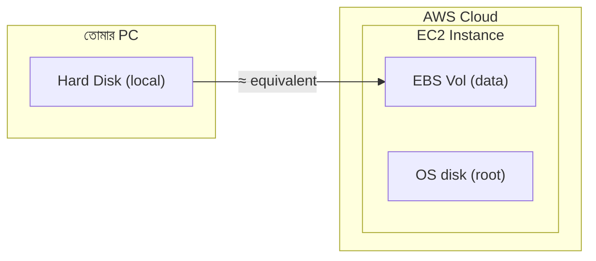
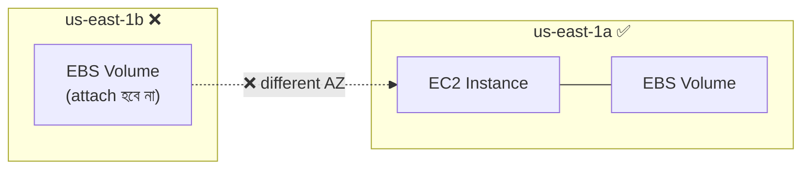
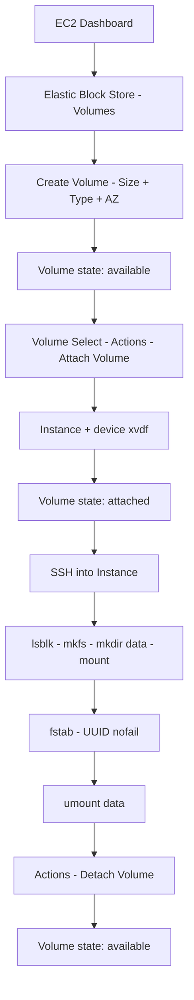

# দিন ৫: Amazon EBS — Elastic Block Store
### Floci দিয়ে হাতে-কলমে শেখো (Git Bash)

> সব কমান্ড **Git Bash**-এ রান করতে হবে।
> কমান্ড রান করার আগে **Docker Desktop** অবশ্যই চালু থাকতে হবে।

📌 **যোগাযোগ / সোশ্যাল মিডিয়া:**
[LinkedIn](https://www.linkedin.com/in/asifaowadud) · [YouTube](https://www.youtube.com/@OOAAOW?sub_confirmation=1) · [Telegram](https://t.me/ooaaow) · [Web Lab](https://oao-devops-lab.vercel.app/) · [Facebook](https://www.facebook.com/OOAAOW/)

---

## আজকে যা যা শিখবে

- EBS কী এবং কেন cloud-এ persistent storage দরকার
- EBS Volume Types এবং কোনটা কখন ব্যবহার করবে
- Floci দিয়ে CLI-তে EBS volume তৈরি, attach, detach, delete
- Volume size বাড়ানো restart ছাড়া
- Real AWS-এ EBS mount করার সম্পূর্ণ পদ্ধতি
- Common mistakes এবং সমাধান

---

## পার্ট ১ — তত্ত্ব (Theory)

### EBS কী?

**EBS = Elastic Block Store**

Amazon EBS হলো AWS-এর block storage service। এটা EC2 instance-এর জন্য **persistent hard disk**-এর মতো কাজ করে।



**মূল বৈশিষ্ট্য:**
- EC2 instance বন্ধ করলেও **data থাকে** (persistent)
- একটি EBS volume এক Availability Zone-এর মধ্যে থাকে
- Snapshot নিয়ে অন্য region-এ copy করা যায়
- চলতে চলতে size বাড়ানো যায় (restart ছাড়া)

---

### EBS কেন দরকার? (DevOps দৃষ্টিকোণ)

| Instance Store | EBS Volume |
|---------------|------------|
| Instance terminate করলে data মুছে যায় | Instance terminate করলেও data থাকে |
| Fixed size | যেকোনো সময় size বাড়ানো যায় |
| Backup নেওয়া কঠিন | Snapshot দিয়ে সহজে backup |
| পুরনো instance type-এ সীমাবদ্ধ | সব modern EC2-তে কাজ করে |

**DevOps-এ EBS ব্যবহার:**
- Database storage (MySQL, PostgreSQL)
- Application data (logs, uploads)
- Kubernetes Persistent Volume
- Jenkins build artifacts

---

### EBS Volume Types

| Type | নাম | IOPS | ব্যবহার |
|------|-----|------|---------|
| `gp3` | General Purpose SSD v3 | 3,000–16,000 | Default — সব ধরনের কাজে |
| `gp2` | General Purpose SSD v2 | 100–3,000 | পুরনো, gp3 বেশি ভালো |
| `io1` / `io2` | Provisioned IOPS SSD | 100–64,000 | High-performance DB |
| `st1` | Throughput Optimized HDD | 500 MB/s | Big data, log processing |
| `sc1` | Cold HDD | 250 MB/s | Archive, rarely accessed |

> **Practice-এ gp3 ব্যবহার করো** — সবচেয়ে flexible এবং cost-effective।

---

### EBS এবং Availability Zone

**গুরুত্বপূর্ণ নিয়ম:** EBS volume এবং EC2 instance **একই AZ**-এ থাকতে হবে।



---

### Best Practices

| নিয়ম | কেন |
|------|-----|
| gp3 ব্যবহার করো gp2-এর বদলে | gp3 সস্তা এবং faster |
| Regular snapshot নাও | Data হারিয়ে গেলে restore করা যাবে |
| Production DB-তে io2 ব্যবহার করো | High IOPS দরকার |
| fstab-এ `nofail` রাখো | Volume না পেলেও instance boot হবে |
| Delete করার আগে detach করো | Data corruption এড়াতে |
| Important data-তে "Delete on Termination" বন্ধ রাখো | Instance terminate করলেও volume থাকবে |

---

## পার্ট ২ — Floci দিয়ে হাতে-কলমে (CLI)

> **Floci-তে EBS support:**
>
> | কমান্ড | Floci |
> |--------|-------|
> | `create-volume` | ✅ কাজ করে |
> | `describe-volumes` | ✅ কাজ করে |
> | `delete-volume` | ✅ কাজ করে |
> | `modify-volume` | ❌ `UnsupportedOperation` |
> | `attach-volume` | ❌ `UnsupportedOperation` |
> | `detach-volume` | ❌ `UnsupportedOperation` |
>
> Attach/detach workflow শেখার জন্য command syntax জানো — Real AWS-এ হুবহু একই command কাজ করবে।

---

### ধাপ ০ — Floci চালু করো

**কেন করছি?**
Floci না চাললে কোনো `aws ec2` কমান্ড কাজ করবে না।

```bash
floci start --persist ./floci-data
eval $(floci env)
```

**যাচাই করো:**
```bash
echo $AWS_ENDPOINT_URL
```

**প্রত্যাশিত output:**
```
http://localhost:4566
```

---

### ধাপ ১ — EC2 Instance চালু করো

**কেন করছি?**
EBS volume attach করতে একটি running instance দরকার। আগে থেকে instance থাকলে এই ধাপ skip করো এবং শুধু Instance ID note করো।

```bash
# Key pair (আগে থেকে থাকলে skip)
aws ec2 create-key-pair --key-name my-ec2-key

# Security group (আগে থেকে থাকলে skip)
aws ec2 create-security-group \
  --group-name my-ec2-sg \
  --description "EC2 SG"

# Security group ID নাও
aws ec2 describe-security-groups \
  --query 'SecurityGroups[?GroupName==`my-ec2-sg`].GroupId' \
  --output text

# Instance launch
aws ec2 run-instances \
  --image-id ami-12345678 \
  --instance-type t2.micro \
  --key-name my-ec2-key \
  --security-group-ids sg-xxxxxxxxxxxxxxxxx \
  --count 1
```

**Instance ID note করো:**
```bash
aws ec2 describe-instances \
  --query 'Reservations[*].Instances[*].[InstanceId,State.Name]' \
  --output table
```

**প্রত্যাশিত output:**
```
+---------------------+---------+
|  i-xxxxxxxxxxxxxxx  | running |
+---------------------+---------+
```

---

### ধাপ ২ — EBS Volume তৈরি করো

**কেন করছি?**
নতুন EBS volume তৈরি করা মানে নতুন hard disk তৈরি করা। এটা এখনও কোনো instance-এর সাথে connected না।

```bash
aws ec2 create-volume \
  --size 5 \
  --volume-type gp3 \
  --availability-zone us-east-1a
```

**প্রত্যাশিত output:**
```json
{
    "VolumeId": "vol-xxxxxxxxxxxxxxxxx",
    "Size": 5,
    "VolumeType": "gp3",
    "State": "available",
    "AvailabilityZone": "us-east-1a",
    "CreateTime": "2026-07-01T00:00:00+00:00",
    "Encrypted": false
}
```

> **`VolumeId` note করো:** `vol-xxxxxxxxxxxxxxxxx` — পরের সব কমান্ডে লাগবে।

**যাচাই করো:**
```bash
aws ec2 describe-volumes --output table
```

**প্রত্যাশিত output:**
```
-----------------------------------------------------------------------
|                          DescribeVolumes                            |
+---------------------+------+--------+-----------+------------------+
|  VolumeId           | Size | Type   | State     | AvailabilityZone |
+---------------------+------+--------+-----------+------------------+
|  vol-xxxxxxxxxx     |  5   | gp3    | available | us-east-1a       |
+---------------------+------+--------+-----------+------------------+
```

---

### ধাপ ৩ — Volume EC2-তে Attach করো

**কেন করছি?**
Volume তৈরি করা মানে hard disk কেনা। Attach করা মানে সেই disk server-এ লাগানো। Attach না করলে OS দেখতে পাবে না।

> ⚠️ **Floci note:** `attach-volume` Floci-তে `UnsupportedOperation` error দেবে — এটা স্বাভাবিক। Command syntax মনে রাখো, Real AWS-এ হুবহু কাজ করবে।

```bash
aws ec2 attach-volume \
  --volume-id vol-xxxxxxxxxxxxxxxxx \
  --instance-id i-xxxxxxxxxxxxxxxxx \
  --device /dev/xvdf
```

**প্রত্যাশিত output:**
```json
{
    "VolumeId": "vol-xxxxxxxxxxxxxxxxx",
    "InstanceId": "i-xxxxxxxxxxxxxxxxx",
    "Device": "/dev/xvdf",
    "State": "attaching",
    "AttachTime": "2026-07-01T00:00:00+00:00"
}
```

**যাচাই করো — State "attached" হয়েছে কিনা:**
```bash
aws ec2 describe-volumes \
  --volume-ids vol-xxxxxxxxxxxxxxxxx \
  --query 'Volumes[0].Attachments'
```

**প্রত্যাশিত output:**
```json
[
    {
        "VolumeId": "vol-xxxxxxxxxxxxxxxxx",
        "InstanceId": "i-xxxxxxxxxxxxxxxxx",
        "Device": "/dev/xvdf",
        "State": "attached"
    }
]
```

> **Real AWS-এ এরপর কী করবে:** Volume attach হওয়ার পরেই **পার্ট ৩** শুরু হয় — SSH দিয়ে instance-এ ঢুকে disk format করো, mount করো, fstab-এ permanent করো। ধাপ ৩ শেষ হলে সরাসরি পার্ট ৩-এ যাও।

---

### ধাপ ৪ — Volume-এ Tag দাও

**কেন করছি?**
Production-এ অনেক volume থাকে। Tag দিলে কোনটা কীসের জন্য সহজে চেনা যায়।

```bash
aws ec2 create-tags \
  --resources vol-xxxxxxxxxxxxxxxxx \
  --tags Key=Name,Value=my-data-volume Key=Environment,Value=dev
```

**প্রত্যাশিত output:**
```
(কোনো output আসবে না — এটা স্বাভাবিক, মানে সফল হয়েছে)
```

---

### ধাপ ৫ — Volume Size বাড়াও (Restart ছাড়া)

**কেন করছি?**
EBS-এর সবচেয়ে বড় সুবিধা — চলতে চলতে size বাড়ানো যায়। Production-এ disk full হলে server বন্ধ না করেই 5 GB থেকে 10 GB করা যায়।

> ⚠️ **Floci note:** `modify-volume` Floci-তে `UnsupportedOperation` দেবে। Real AWS-এ কাজ করবে।

```bash
aws ec2 modify-volume \
  --volume-id vol-xxxxxxxxxxxxxxxxx \
  --size 10
```

**প্রত্যাশিত output:**
```json
{
    "VolumeModification": {
        "VolumeId": "vol-xxxxxxxxxxxxxxxxx",
        "ModificationState": "modifying",
        "TargetSize": 10,
        "OriginalSize": 5,
        "TargetVolumeType": "gp3",
        "StartTime": "2026-07-01T00:00:00+00:00"
    }
}
```

**যাচাই করো — নতুন size দেখো:**
```bash
aws ec2 describe-volumes \
  --volume-ids vol-xxxxxxxxxxxxxxxxx \
  --query 'Volumes[0].Size'
```

**প্রত্যাশিত output:**
```
10
```

> **Floci vs Real AWS — Volume Resize:**
>
> | | Floci | Real AWS |
> |-|-------|----------|
> | `modify-volume` | ✅ API accept করে, size update হয় | ✅ Volume physically বড় হয় |
> | Filesystem resize দরকার? | ❌ Real disk নেই | ✅ হ্যাঁ — `growpart` + `xfs_growfs` বা `resize2fs` |
>
> Real AWS-এ volume বড় হলেই হয় না — instance-এর ভেতরে filesystem-ও বাড়াতে হয়। সেটা Part 3-এ দেখানো হয়েছে।

---

### ধাপ ৬ — Volume Detach করো

**কেন করছি?**
Volume অন্য instance-এ লাগাতে হলে বা delete করতে হলে আগে detach করতে হবে।

> ⚠️ **Floci note:** `detach-volume`-ও Floci-তে `UnsupportedOperation` দেবে। Real AWS-এ কাজ করবে।

```bash
aws ec2 detach-volume \
  --volume-id vol-xxxxxxxxxxxxxxxxx
```

**প্রত্যাশিত output:**
```json
{
    "VolumeId": "vol-xxxxxxxxxxxxxxxxx",
    "InstanceId": "i-xxxxxxxxxxxxxxxxx",
    "Device": "/dev/xvdf",
    "State": "detaching"
}
```

**যাচাই করো:**
```bash
aws ec2 describe-volumes \
  --volume-ids vol-xxxxxxxxxxxxxxxxx \
  --query 'Volumes[0].State' \
  --output text
```

**প্রত্যাশিত output:**
```
available
```

---

### ধাপ ৭ — Volume Delete করো (Cleanup)

**কেন করছি?**
Practice শেষে volume মুছে রাখা ভালো অভ্যাস। Real AWS-এ volume থাকলে charge চলতে থাকে।

```bash
aws ec2 delete-volume \
  --volume-id vol-xxxxxxxxxxxxxxxxx
```

**প্রত্যাশিত output:**
```
(কোনো output আসবে না — এটা স্বাভাবিক, মানে সফল হয়েছে)
```

**যাচাই করো:**
```bash
aws ec2 describe-volumes
```

**প্রত্যাশিত output:**
```json
{
    "Volumes": []
}
```

---

## পার্ট ৩ — Real AWS-এ EBS Mount করা (Reference)

> **কখন করবে:** পার্ট ২-এর **ধাপ ৩ (Volume Attach)** সফলভাবে শেষ হওয়ার পরেই এই section শুরু হয়। Volume state "attached" হলেই instance-এর ভেতরে disk দেখা যায় — তখন নিচের steps follow করো।
>
> এই section Floci-তে কাজ করবে না। Real AWS Free Tier account-এ EC2 instance চালিয়ে এই steps follow করো।

---

### Real AWS-এ EBS Volume Attach করার পর

**১. SSH দিয়ে EC2-তে ঢোকো:**

```bash
chmod 400 my-ec2-key.pem
ssh -i my-ec2-key.pem ec2-user@YOUR_PUBLIC_IP
```

**২. নতুন disk দেখো:**

```bash
lsblk
```

**প্রত্যাশিত output:**
```
NAME    MAJ:MIN RM  SIZE RO TYPE MOUNTPOINT
xvda    202:0    0    8G  0 disk
└─xvda1 202:1    0    8G  0 part /
xvdf    202:80   0    5G  0 disk       ← নতুন EBS volume
```

**৩. Disk format করো:**

**কেন করছি?** নতুন disk attach করলে সেটা raw থাকে — কোনো filesystem নেই। Filesystem ছাড়া OS data লিখতে পারে না, ঠিক যেমন নতুন hard disk কিনলে প্রথমে format করতে হয়।

```bash
sudo mkfs -t ext4 /dev/xvdf
```

**৪. Mount directory তৈরি করো:**

**কেন করছি?** Linux-এ disk সরাসরি `/dev/xvdf` হিসেবে ব্যবহার করা যায় না — একটা directory-তে "connect" করতে হয়। `/data` হলো সেই entry point যেখান থেকে disk access করা যাবে।

```bash
sudo mkdir /data
```

**৫. Mount করো:**

**কেন করছি?** Mount মানে disk-টাকে `/data` directory-র সাথে সংযুক্ত করা। এই কমান্ডের পরেই `/data`-তে গেলে EBS volume-এর storage পাওয়া যাবে।

```bash
sudo mount /dev/xvdf /data
```

**৬. যাচাই করো:**

```bash
df -h
```

**প্রত্যাশিত output:**
```
Filesystem      Size  Used Avail Use% Mounted on
/dev/xvdf       4.9G   20M  4.6G   1% /data
```

**৭. Test করো:**

```bash
cd /data
sudo touch testfile
ls
```

**প্রত্যাশিত output:**
```
testfile
```

---

### Mount Permanent করো (Reboot-proof)

Instance restart করলে mount হারিয়ে যায়। fstab-এ লিখলে permanent হয়।

**১. UUID নাও:**

```bash
sudo blkid /dev/xvdf
```

**প্রত্যাশিত output:**
```
/dev/xvdf: UUID="xxxxxxxx-xxxx-xxxx-xxxx-xxxxxxxxxxxx" TYPE="ext4"
```

**২. fstab-এ যোগ করো:**

**কেন করছি?** `/etc/fstab` হলো Linux-এর auto-mount configuration file। Instance restart হলে OS এই file পড়ে এবং listed volume গুলো automatically mount করে। এখানে না লিখলে restart-এর পর mount হারিয়ে যাবে এবং `/data` empty দেখাবে।

```bash
sudo vi /etc/fstab
```

নিচের লাইন যোগ করো (UUID তোমার নিজেরটা দাও):
```
UUID=xxxxxxxx-xxxx-xxxx-xxxx-xxxxxxxxxxxx  /data  ext4  defaults,nofail  0  2
```

> **`nofail` কেন:** Volume না পেলেও instance boot হবে — EBS unmounted থাকলে instance আটকে যাবে না।

**৩. Test করো:**

```bash
sudo mount -a
```

**প্রত্যাশিত output:**
```
(কোনো output আসবে না — এটা স্বাভাবিক, মানে fstab ঠিক আছে)
```

---

### Volume Size বাড়ানোর পর Filesystem Resize করো

> **কখন এই section লাগবে:**
> Volume already mounted এবং ব্যবহার হচ্ছে — এরপর AWS Console বা CLI থেকে size বাড়িয়েছ (যেমন 10G → 20G)। তখন instance-এ SSH করে নিচের command চালাও।
>
> **নতুন volume তৈরি করে প্রথমবার format করলে এই section লাগবে না** — `mkfs` করার সময়ই পুরো disk নেয়।

**কেন করছি?** AWS থেকে volume বড় করলে শুধু physical disk-এর size বাড়ে — কিন্তু OS এখনও পুরনো size দেখে, কারণ filesystem সেই পুরনো boundary অনুযায়ী কাজ করছে। নতুন space ব্যবহার করতে হলে filesystem-কেও বলতে হবে "তুমি এখন বড়।"

---

**ধাপ ১ — AWS Console থেকে Volume Size বাড়াও**

**কেন করছি?** এটাই মূল কাজ — AWS-কে বলছি "এই disk-এর physical size বাড়াও।" Instance বন্ধ করতে হবে না।

```
EC2 Dashboard
  → Elastic Block Store → Volumes
  → Volume select করো
  → Actions → Modify Volume
  → Size: 10 → 20 (যত GB চাও)
  → Modify → Confirm
```

Volume-এর State পরিবর্তন হবে:
```
in-use → optimizing → in-use (completed)
```

> CLI দিয়েও করা যায়:
> ```bash
> aws ec2 modify-volume --volume-id vol-xxxxxxxxx --size 20
> ```

---

**ধাপ ২ — Instance-এ SSH করো এবং যাচাই করো**

**কেন করছি?** Console-এ size বাড়ানো হয়েছে কিনা এবং OS দেখতে পাচ্ছে কিনা সেটা check করি।

```bash
lsblk
```

**প্রত্যাশিত output:**
```
nvme1n1   259:4   0  20G  0 disk    ← disk এখন 20G
```

```bash
df -h
```

**প্রত্যাশিত output:**
```
/dev/nvme1n1   9.8G  ... /data      ← কিন্তু filesystem এখনও পুরনো size
```

> এই পার্থক্যটাই বলছে — disk বড় হয়েছে, কিন্তু filesystem এখনও পুরনো boundary-তে আছে।

---

**ধাপ ৩ — Filesystem Resize করো**

**কোন command কখন লাগবে:**

| Disk type | Command |
|-----------|---------|
| Root disk (partition আছে — nvme0n1p1) | `growpart /dev/nvme0n1 1` তারপর `xfs_growfs -d /` |
| Data disk (partition নেই — nvme1n1) | শুধু `resize2fs /dev/nvme1n1` |

> **Device name সম্পর্কে:** `--device /dev/xvdf` দিয়ে attach করলেও modern AWS instance-এ `lsblk`-এ `nvme1n1` দেখাবে। AWS internally map করে — এটা normal।

**Root disk resize (XFS — Amazon Linux 2023):**

```bash
sudo growpart /dev/nvme0n1 1
sudo xfs_growfs -d /
```

**Data disk resize (ext4, partition ছাড়া — তোমার case):**

```bash
sudo resize2fs /dev/nvme1n1
```

---

**ধাপ ৪ — যাচাই করো**

```bash
df -h
```

**প্রত্যাশিত output:**
```
/dev/nvme1n1   20G  ... /data      ← এখন 20G দেখাচ্ছে ✅
```

---

## সাধারণ Mistake এবং সমাধান

| Mistake | কী হয় | সমাধান |
|---------|--------|--------|
| ভিন্ন AZ-তে volume তৈরি | Attach করা যায় না | EC2-এর same AZ-তে volume তৈরি করো |
| Format ছাড়া mount | Mount error | `mkfs -t ext4` দিয়ে format করো |
| fstab-এ যোগ না করা | Reboot-এর পর mount নেই | UUID দিয়ে fstab-এ `nofail` সহ লেখো |
| Detach না করে delete | `InvalidVolume.InUse` error | আগে `detach-volume`, তারপর `delete-volume` |
| `nofail` না দেওয়া | Volume না পেলে instance boot হয় না | fstab-এ `defaults,nofail` দাও |
| Volume resize করে filesystem resize না করলে | `df -h`-তে নতুন size দেখা যায় না | `growpart` + `xfs_growfs` বা `resize2fs` চালাও |

---

## দ্রুত তথ্যসূত্র — EBS CLI চিট শিট

| কমান্ড | কী করে |
|--------|--------|
| `aws ec2 create-volume --size <n> --volume-type gp3 --availability-zone <az>` | Volume তৈরি |
| `aws ec2 describe-volumes` | সব volume দেখো |
| `aws ec2 describe-volumes --volume-ids <vol-id>` | নির্দিষ্ট volume দেখো |
| `aws ec2 attach-volume --volume-id <vol-id> --instance-id <i-id> --device /dev/xvdf` | Instance-এ attach করো |
| `aws ec2 detach-volume --volume-id <vol-id>` | Detach করো |
| `aws ec2 modify-volume --volume-id <vol-id> --size <n>` | Size বাড়াও |
| `aws ec2 create-tags --resources <vol-id> --tags Key=Name,Value=<v>` | Tag দাও |
| `aws ec2 delete-volume --volume-id <vol-id>` | Volume মুছো |
| `lsblk` | Instance-এ disk দেখো (Real AWS) |
| `sudo mkfs -t ext4 /dev/xvdf` | Disk format করো (Real AWS) |
| `sudo mount /dev/xvdf /data` | Mount করো (Real AWS) |
| `sudo blkid /dev/xvdf` | UUID দেখো (Real AWS) |
| `sudo growpart /dev/xvda 1` | Partition বড় করো (Real AWS) |
| `sudo xfs_growfs -d /` | XFS filesystem resize (Real AWS) |
| `sudo resize2fs /dev/xvdf` | ext4 filesystem resize (Real AWS) |

---

## Real AWS Console-এ ফ্লো (রেফারেন্স)

**সংক্ষেপে:**
`EC2 Dashboard → Elastic Block Store → Volumes → Create Volume → Volume Select → Actions → Attach Volume → SSH → lsblk / mkfs / mount → fstab → Unmount → Detach`

<details>
<summary>📊 বিস্তারিত ভিজ্যুয়াল ডায়াগ্রাম দেখতে ক্লিক করো</summary>



</details>

---

## আজকে যা তৈরি করলে

```
EBS Setup (Floci CLI)
├── EC2 Instance     → running (EBS attach-এর জন্য)
├── EBS Volume       → vol-xxxxxxxxx (5 GB, gp3, us-east-1a)
│   ├── Attach       → /dev/xvdf হিসেবে EC2-তে
│   ├── Tag          → Name=my-data-volume, Environment=dev
│   ├── Modify       → 5 GB → 10 GB (restart ছাড়া)
│   └── Detach       → available state-এ ফেরত
└── Real AWS Reference
    ├── lsblk        → disk দেখা
    ├── mkfs         → ext4 format
    ├── mount        → /data-এ
    ├── fstab        → permanent mount (nofail)
    └── growpart + xfs_growfs → filesystem resize
```

---

## বাড়ির কাজ

১. দুটো আলাদা EBS volume তৈরি করো — একটা 5 GB gp3, একটা 10 GB gp3। একটি EC2 instance-এ দুটোই attach করো।
২. একটি volume তৈরির পর tag করো (`Name=database-volume`, `Environment=prod`)। তারপর সেই tag দিয়ে CLI-তে volume খুঁজে বের করো।
৩. Real AWS-এ (Free Tier): EBS volume attach করে `/data`-তে mount করো, একটি file তৈরি করো, instance restart করো — file কি থাকে?

---

## রিসোর্স

- Floci অফিসিয়াল: [https://floci.io](https://floci.io)
- Floci AWS সার্ভিস তালিকা: [https://floci.io/aws](https://floci.io/aws)
- AWS EBS CLI Reference: [https://docs.aws.amazon.com/cli/latest/reference/ec2/](https://docs.aws.amazon.com/cli/latest/reference/ec2/)
- AWS EBS User Guide: [https://docs.aws.amazon.com/AWSEC2/latest/UserGuide/AmazonEBS.html](https://docs.aws.amazon.com/AWSEC2/latest/UserGuide/AmazonEBS.html)
