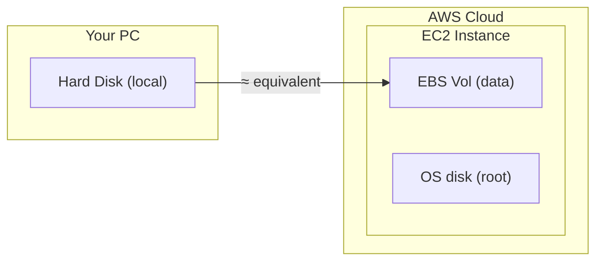
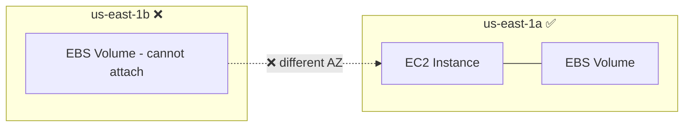
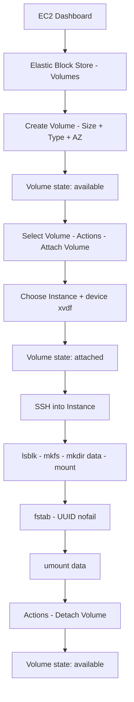

# Day 5: Amazon EBS — Elastic Block Store
### Hands-on with Floci (Git Bash)

> All CLI commands must be run in **Git Bash**.
> **Docker Desktop** must be running before executing any commands.

📌 **Connect / Social Media:**
[LinkedIn](https://www.linkedin.com/in/asifaowadud) · [YouTube](https://www.youtube.com/@OOAAOW?sub_confirmation=1) · [Telegram](https://t.me/ooaaow) · [Web Lab](https://oao-devops-lab.vercel.app/) · [Facebook](https://www.facebook.com/OOAAOW/)

---

## What You'll Learn Today

- What EBS is and why persistent storage matters in the cloud
- EBS Volume Types and when to use each
- Create, attach, detach, and delete EBS volumes using Floci CLI
- Increase volume size without restarting the instance
- Full walkthrough for mounting EBS in real AWS
- Common mistakes and how to fix them

---

## Part 1 — Theory

### What is EBS?

**EBS = Elastic Block Store**

Amazon EBS is AWS's block storage service. It works like a **persistent hard disk** for EC2 instances.



**Key properties:**
- Data **persists** even after stopping the instance
- A volume lives in one Availability Zone
- Snapshots can be copied across regions
- Size can be increased while the instance is running (no restart needed)

---

### Why EBS? (DevOps Perspective)

| Instance Store | EBS Volume |
|---------------|------------|
| Data lost when instance terminates | Data survives instance termination |
| Fixed size | Resize anytime |
| Hard to back up | Easy backup via snapshot |
| Limited to legacy instance types | Works with all modern EC2 |

**DevOps use cases:**
- Database storage (MySQL, PostgreSQL)
- Application data (logs, uploads)
- Kubernetes Persistent Volumes
- Jenkins build artifacts

---

### EBS Volume Types

| Type | Name | IOPS | Use Case |
|------|------|------|----------|
| `gp3` | General Purpose SSD v3 | 3,000–16,000 | Default — suitable for most workloads |
| `gp2` | General Purpose SSD v2 | 100–3,000 | Legacy; gp3 is better |
| `io1` / `io2` | Provisioned IOPS SSD | 100–64,000 | High-performance databases |
| `st1` | Throughput Optimized HDD | 500 MB/s | Big data, log processing |
| `sc1` | Cold HDD | 250 MB/s | Archive, infrequent access |

> **Use gp3 for practice** — most flexible and cost-effective.

---

### EBS and Availability Zone

**Important rule:** An EBS volume and the EC2 instance must be in the **same AZ**.



---

### Best Practices

| Rule | Why |
|------|-----|
| Use gp3 over gp2 | Cheaper and faster |
| Take regular snapshots | Allows restore if data is lost |
| Use io2 for production databases | High IOPS required |
| Add `nofail` to fstab | Instance still boots if volume is unavailable |
| Detach before deleting | Prevents data corruption |
| Disable "Delete on Termination" for critical data | Volume survives instance termination |

---

## Part 2 — Hands-On with Floci (CLI)

> **Floci EBS support:**
>
> | Command | Floci |
> |---------|-------|
> | `create-volume` | ✅ works |
> | `describe-volumes` | ✅ works |
> | `delete-volume` | ✅ works |
> | `modify-volume` | ❌ `UnsupportedOperation` |
> | `attach-volume` | ❌ `UnsupportedOperation` |
> | `detach-volume` | ❌ `UnsupportedOperation` |
>
> Learn the attach/detach syntax here — the exact same commands work on real AWS.

---

### Step 0 — Start Floci

**Why:** Without Floci running, no `aws ec2` command will work.

```bash
floci start --persist ./floci-data
eval $(floci env)
```

**Verify:**
```bash
echo $AWS_ENDPOINT_URL
```

**Expected output:**
```
http://localhost:4566
```

---

### Step 1 — Launch an EC2 Instance

**Why:** You need a running instance to attach a volume to. Skip this step if you already have one running — just note the Instance ID.

```bash
# Key pair (skip if already exists)
aws ec2 create-key-pair --key-name my-ec2-key

# Security group (skip if already exists)
aws ec2 create-security-group \
  --group-name my-ec2-sg \
  --description "EC2 SG"

# Get the security group ID
aws ec2 describe-security-groups \
  --query 'SecurityGroups[?GroupName==`my-ec2-sg`].GroupId' \
  --output text

# Launch instance
aws ec2 run-instances \
  --image-id ami-12345678 \
  --instance-type t2.micro \
  --key-name my-ec2-key \
  --security-group-ids sg-xxxxxxxxxxxxxxxxx \
  --count 1
```

**Note the Instance ID:**
```bash
aws ec2 describe-instances \
  --query 'Reservations[*].Instances[*].[InstanceId,State.Name]' \
  --output table
```

**Expected output:**
```
+---------------------+---------+
|  i-xxxxxxxxxxxxxxx  | running |
+---------------------+---------+
```

---

### Step 2 — Create an EBS Volume

**Why:** Creating an EBS volume is like buying a new hard disk. It is not connected to any instance yet.

```bash
aws ec2 create-volume \
  --size 5 \
  --volume-type gp3 \
  --availability-zone us-east-1a
```

**Expected output:**
```json
{
    "VolumeId": "vol-xxxxxxxxxxxxxxxxx",
    "Size": 5,
    "VolumeType": "gp3",
    "State": "available",
    "AvailabilityZone": "us-east-1a",
    "CreateTime": "2026-07-01T00:00:00+00:00",
    "Encrypted": false
}
```

> **Note the `VolumeId`:** `vol-xxxxxxxxxxxxxxxxx` — needed for all subsequent commands.

**Verify:**
```bash
aws ec2 describe-volumes --output table
```

**Expected output:**
```
-----------------------------------------------------------------------
|                          DescribeVolumes                            |
+---------------------+------+--------+-----------+------------------+
|  VolumeId           | Size | Type   | State     | AvailabilityZone |
+---------------------+------+--------+-----------+------------------+
|  vol-xxxxxxxxxx     |  5   | gp3    | available | us-east-1a       |
+---------------------+------+--------+-----------+------------------+
```

---

### Step 3 — Attach the Volume to EC2

**Why:** Creating a volume is buying the disk; attaching it is plugging it into the server. Without attaching, the OS cannot see the disk.

> ⚠️ **Floci note:** `attach-volume` returns `UnsupportedOperation` in Floci — this is expected. Learn the syntax here; it works identically on real AWS.

```bash
aws ec2 attach-volume \
  --volume-id vol-xxxxxxxxxxxxxxxxx \
  --instance-id i-xxxxxxxxxxxxxxxxx \
  --device /dev/xvdf
```

**Expected output:**
```json
{
    "VolumeId": "vol-xxxxxxxxxxxxxxxxx",
    "InstanceId": "i-xxxxxxxxxxxxxxxxx",
    "Device": "/dev/xvdf",
    "State": "attaching",
    "AttachTime": "2026-07-01T00:00:00+00:00"
}
```

**Verify — check that State is "attached":**
```bash
aws ec2 describe-volumes \
  --volume-ids vol-xxxxxxxxxxxxxxxxx \
  --query 'Volumes[0].Attachments'
```

**Expected output:**
```json
[
    {
        "VolumeId": "vol-xxxxxxxxxxxxxxxxx",
        "InstanceId": "i-xxxxxxxxxxxxxxxxx",
        "Device": "/dev/xvdf",
        "State": "attached"
    }
]
```

> **On real AWS — what to do next:** Once the volume state shows "attached", go directly to **Part 3** — SSH into the instance, format the disk, mount it, and make the mount permanent. Part 3 starts exactly where Step 3 ends.

---

### Step 4 — Tag the Volume

**Why:** In production, you may have dozens of volumes. Tags let you quickly identify what each one is for.

```bash
aws ec2 create-tags \
  --resources vol-xxxxxxxxxxxxxxxxx \
  --tags Key=Name,Value=my-data-volume Key=Environment,Value=dev
```

**Expected output:**
```
(no output — this is normal, it means the tag was applied successfully)
```

---

### Step 5 — Increase Volume Size (Without Restart)

**Why:** One of EBS's biggest advantages is live resizing. In production, if a disk fills up you can expand from 5 GB to 10 GB without stopping the instance.

> ⚠️ **Floci note:** `modify-volume` returns `UnsupportedOperation` in Floci. Works on real AWS.

```bash
aws ec2 modify-volume \
  --volume-id vol-xxxxxxxxxxxxxxxxx \
  --size 10
```

**Expected output:**
```json
{
    "VolumeModification": {
        "VolumeId": "vol-xxxxxxxxxxxxxxxxx",
        "ModificationState": "modifying",
        "TargetSize": 10,
        "OriginalSize": 5,
        "TargetVolumeType": "gp3",
        "StartTime": "2026-07-01T00:00:00+00:00"
    }
}
```

**Verify — check new size:**
```bash
aws ec2 describe-volumes \
  --volume-ids vol-xxxxxxxxxxxxxxxxx \
  --query 'Volumes[0].Size'
```

**Expected output:**
```
10
```

> **Floci vs Real AWS — Volume Resize:**
>
> | | Floci | Real AWS |
> |-|-------|----------|
> | `modify-volume` | ✅ API accepts it, size updates | ✅ Volume physically grows |
> | Filesystem resize needed? | ❌ No real disk | ✅ Yes — `growpart` + `xfs_growfs` or `resize2fs` |
>
> On real AWS, resizing the volume alone is not enough — the filesystem inside the instance must also be grown. See Part 3.

---

### Step 6 — Detach the Volume

**Why:** Before moving a volume to another instance or deleting it, it must be detached first.

> ⚠️ **Floci note:** `detach-volume` also returns `UnsupportedOperation` in Floci. Works on real AWS.

```bash
aws ec2 detach-volume \
  --volume-id vol-xxxxxxxxxxxxxxxxx
```

**Expected output:**
```json
{
    "VolumeId": "vol-xxxxxxxxxxxxxxxxx",
    "InstanceId": "i-xxxxxxxxxxxxxxxxx",
    "Device": "/dev/xvdf",
    "State": "detaching"
}
```

**Verify:**
```bash
aws ec2 describe-volumes \
  --volume-ids vol-xxxxxxxxxxxxxxxxx \
  --query 'Volumes[0].State' \
  --output text
```

**Expected output:**
```
available
```

---

### Step 7 — Delete the Volume (Cleanup)

**Why:** Good practice after practice sessions. On real AWS, unused volumes continue to incur storage charges.

```bash
aws ec2 delete-volume \
  --volume-id vol-xxxxxxxxxxxxxxxxx
```

**Expected output:**
```
(no output — this is normal, it means the volume was deleted successfully)
```

**Verify:**
```bash
aws ec2 describe-volumes
```

**Expected output:**
```json
{
    "Volumes": []
}
```

---

## Part 3 — Mounting EBS in Real AWS (Reference)

> **When to do this:** Start this section immediately after **Step 3 (Attach Volume)** completes. Once the volume state is "attached", the disk is visible inside the instance — follow the steps below.
>
> This section does not apply to Floci. Follow these steps when working with a real AWS Free Tier EC2 instance.

---

### After Attaching the EBS Volume on Real AWS

**1. SSH into the EC2 instance:**

```bash
chmod 400 my-ec2-key.pem
ssh -i my-ec2-key.pem ec2-user@YOUR_PUBLIC_IP
```

**2. List disks:**

```bash
lsblk
```

**Expected output:**
```
NAME    MAJ:MIN RM  SIZE RO TYPE MOUNTPOINT
xvda    202:0    0    8G  0 disk
└─xvda1 202:1    0    8G  0 part /
xvdf    202:80   0    5G  0 disk       ← new EBS volume
```

**3. Format the disk:**

**Why:** A newly attached disk is raw — it has no filesystem. Without a filesystem, the OS cannot read or write data, just like a brand-new hard drive that needs to be formatted before use.

```bash
sudo mkfs -t ext4 /dev/xvdf
```

**4. Create a mount directory:**

**Why:** In Linux, you cannot use a disk directly at `/dev/xvdf` — it must be "connected" to a directory first. `/data` is that entry point; accessing it will give you the EBS volume's storage.

```bash
sudo mkdir /data
```

**5. Mount the volume:**

**Why:** Mounting links the disk to the `/data` directory. After this command, any files written to `/data` are stored on the EBS volume.

```bash
sudo mount /dev/xvdf /data
```

**6. Verify:**

```bash
df -h
```

**Expected output:**
```
Filesystem      Size  Used Avail Use% Mounted on
/dev/xvdf       4.9G   20M  4.6G   1% /data
```

**7. Test:**

```bash
cd /data
sudo touch testfile
ls
```

**Expected output:**
```
testfile
```

---

### Make the Mount Permanent (Reboot-proof)

Without this, the mount is lost after an instance restart.

**1. Get the UUID:**

```bash
sudo blkid /dev/xvdf
```

**Expected output:**
```
/dev/xvdf: UUID="xxxxxxxx-xxxx-xxxx-xxxx-xxxxxxxxxxxx" TYPE="ext4"
```

**2. Edit fstab:**

**Why:** `/etc/fstab` is Linux's auto-mount configuration file. On every reboot, the OS reads this file and mounts the listed volumes automatically. Without this entry, the mount is lost after a restart and `/data` will appear empty.

```bash
sudo vi /etc/fstab
```

Add this line (use your actual UUID):
```
UUID=xxxxxxxx-xxxx-xxxx-xxxx-xxxxxxxxxxxx  /data  ext4  defaults,nofail  0  2
```

> **Why `nofail`:** If the volume is unavailable, the instance still boots instead of hanging.

**3. Test the fstab entry:**

```bash
sudo mount -a
```

**Expected output:**
```
(no output — this is normal, it means fstab is correct)
```

---

### Resize the Filesystem After Expanding the Volume

**Why:** Expanding the volume in AWS only grows the physical disk — the OS still sees the old size because the filesystem is still using the old boundary. You must tell the filesystem to expand into the newly available space.

**Grow the partition:**

```bash
sudo growpart /dev/xvda 1
```

**Resize XFS filesystem (Amazon Linux 2023):**

```bash
sudo xfs_growfs -d /
```

**Resize ext4 filesystem:**

```bash
sudo resize2fs /dev/xvdf
```

**Verify:**

```bash
df -h
```

---

## Common Mistakes and Solutions

| Mistake | What Happens | Fix |
|---------|-------------|-----|
| Volume created in wrong AZ | Cannot attach to EC2 | Create volume in the same AZ as the EC2 instance |
| Mounting without formatting | Mount error | Format with `mkfs -t ext4` first |
| Not adding to fstab | Mount lost after reboot | Add UUID entry with `nofail` to `/etc/fstab` |
| Deleting without detaching first | `InvalidVolume.InUse` error | Run `detach-volume` before `delete-volume` |
| Missing `nofail` in fstab | Instance fails to boot if volume unavailable | Use `defaults,nofail` in fstab |
| Resizing volume but not filesystem | `df -h` still shows old size | Run `growpart` + `xfs_growfs` or `resize2fs` |

---

## Quick Reference — EBS CLI Cheat Sheet

| Command | What It Does |
|---------|-------------|
| `aws ec2 create-volume --size <n> --volume-type gp3 --availability-zone <az>` | Create a volume |
| `aws ec2 describe-volumes` | List all volumes |
| `aws ec2 describe-volumes --volume-ids <vol-id>` | Inspect a specific volume |
| `aws ec2 attach-volume --volume-id <vol-id> --instance-id <i-id> --device /dev/xvdf` | Attach to an instance |
| `aws ec2 detach-volume --volume-id <vol-id>` | Detach from instance |
| `aws ec2 modify-volume --volume-id <vol-id> --size <n>` | Increase volume size |
| `aws ec2 create-tags --resources <vol-id> --tags Key=Name,Value=<v>` | Add a tag |
| `aws ec2 delete-volume --volume-id <vol-id>` | Delete a volume |
| `lsblk` | List disks inside instance (Real AWS) |
| `sudo mkfs -t ext4 /dev/xvdf` | Format disk (Real AWS) |
| `sudo mount /dev/xvdf /data` | Mount volume (Real AWS) |
| `sudo blkid /dev/xvdf` | Get UUID (Real AWS) |
| `sudo growpart /dev/xvda 1` | Grow partition (Real AWS) |
| `sudo xfs_growfs -d /` | Resize XFS filesystem (Real AWS) |
| `sudo resize2fs /dev/xvdf` | Resize ext4 filesystem (Real AWS) |

---

## Real AWS Console Flow (Reference)

**Quick summary:**
`EC2 Dashboard → Elastic Block Store → Volumes → Create Volume → Select Volume → Actions → Attach Volume → SSH → lsblk / mkfs / mount → fstab → Unmount → Detach`

<details>
<summary>📊 Click to expand visual diagram</summary>



</details>

---

## What You Built Today

```
EBS Setup (Floci CLI)
├── EC2 Instance     → running (needed for attach)
├── EBS Volume       → vol-xxxxxxxxx (5 GB, gp3, us-east-1a)
│   ├── Attach       → connected as /dev/xvdf to EC2
│   ├── Tag          → Name=my-data-volume, Environment=dev
│   ├── Modify       → 5 GB → 10 GB (no restart)
│   └── Detach       → back to available state
└── Real AWS Reference
    ├── lsblk        → see the disk
    ├── mkfs         → ext4 format
    ├── mount        → mount at /data
    ├── fstab        → permanent mount (nofail)
    └── growpart + xfs_growfs → resize filesystem
```

---

## Homework

1. Create two separate EBS volumes — one 5 GB gp3, one 10 GB gp3. Attach both to a single EC2 instance.
2. Create a volume, tag it (`Name=database-volume`, `Environment=prod`), then use that tag to find the volume with a CLI query.
3. On real AWS (Free Tier): attach an EBS volume, mount it at `/data`, create a file, restart the instance — is the file still there?

---

## Resources

- Floci official: [https://floci.io](https://floci.io)
- Floci AWS services: [https://floci.io/aws](https://floci.io/aws)
- AWS EBS CLI Reference: [https://docs.aws.amazon.com/cli/latest/reference/ec2/](https://docs.aws.amazon.com/cli/latest/reference/ec2/)
- AWS EBS User Guide: [https://docs.aws.amazon.com/AWSEC2/latest/UserGuide/AmazonEBS.html](https://docs.aws.amazon.com/AWSEC2/latest/UserGuide/AmazonEBS.html)
