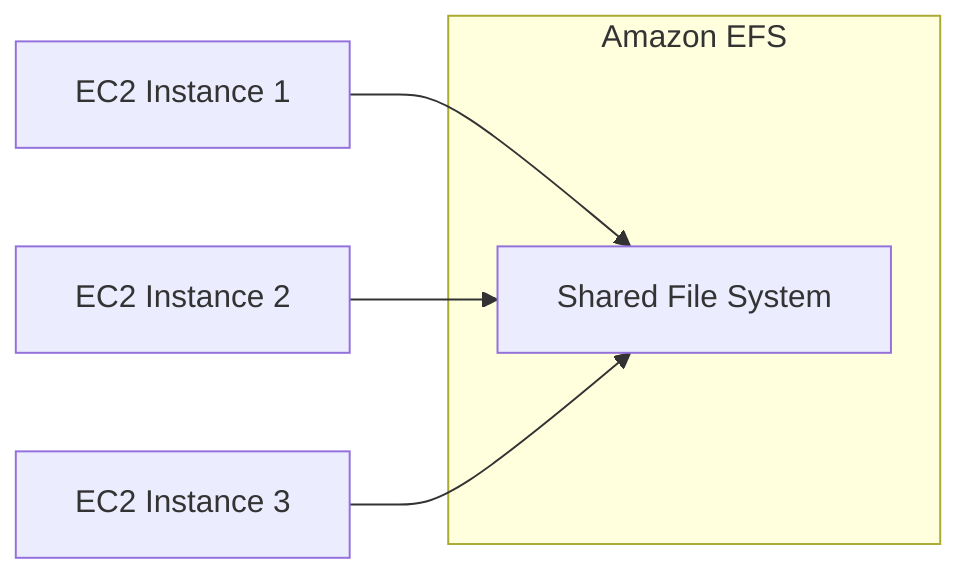
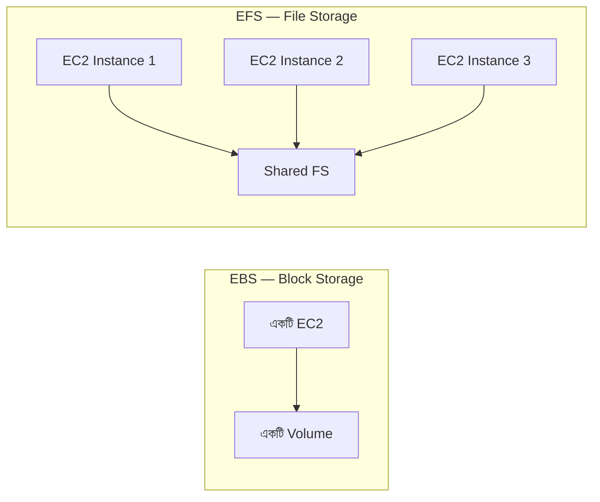
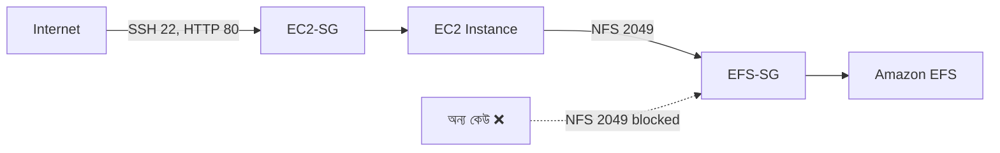
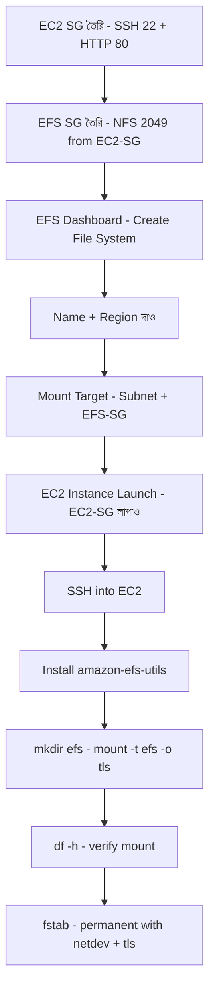

# দিন ৬: Amazon EFS — Elastic File System
### Floci দিয়ে হাতে-কলমে শেখো (Git Bash)

> সব কমান্ড **Git Bash**-এ রান করতে হবে।
> কমান্ড রান করার আগে **Docker Desktop** অবশ্যই চালু থাকতে হবে।

📌 **যোগাযোগ / সোশ্যাল মিডিয়া:**
[LinkedIn](https://www.linkedin.com/in/asifaowadud) · [YouTube](https://www.youtube.com/@OOAAOW?sub_confirmation=1) · [Telegram](https://t.me/ooaaow) · [Web Lab](https://oao-devops-lab.vercel.app/) · [Facebook](https://www.facebook.com/OOAAOW/)

---

## আজকে যা যা শিখবে

- EFS কী এবং EBS-এর সাথে পার্থক্য কী
- S3 vs EBS vs EFS — কোনটা কখন ব্যবহার করবে
- দুটো Security Group দিয়ে EFS-কে নিরাপদ রাখার কৌশল
- Floci দিয়ে CLI-তে EFS তৈরি এবং manage করা
- Real AWS-এ EFS mount করে shared storage test করা
- Common mistakes এবং সমাধান

---

## পার্ট ১ — তত্ত্ব (Theory)

### EFS কী?

**EFS = Elastic File System**

Amazon EFS হলো AWS-এর managed file storage service। এটা একটা **shared network drive** যেখানে একসাথে অনেকগুলো EC2 instance connect করতে পারে।



**মূল বৈশিষ্ট্য:**
- একসাথে **অনেক EC2** connect করতে পারে (EBS পারে না)
- Storage **automatically বাড়ে** — আগে থেকে size ঠিক করতে হয় না
- Multiple AZ-এ redundant — EBS শুধু একটা AZ-এ থাকে
- NFS protocol ব্যবহার করে

---

### S3 vs EBS vs EFS — কোনটা কখন?

| Category | S3 | EBS | EFS |
|----------|----|-----|-----|
| Storage Type | Object Storage | Block Storage | File Storage |
| Pricing | Pay as you Use | Pay for provisioned capacity | Pay as you Use |
| Storage Size | Unlimited | Limited | Unlimited |
| Scalability | Unlimited | Manual increase/decrease | Unlimited Auto |
| Durability | Multiple AZ-এ redundant | Single AZ-এ redundant | Multiple AZ-এ redundant |
| Availability | 99.99% (S3 Standard) | 99.99% | No SLA |
| Security | Encryption at rest + transit | Encryption at rest + transit | Encryption at rest + transit |
| Backup | Versioning + cross-region | Automated snapshots | EFS-to-EFS replication |
| Performance | Slowest | Fastest | S3-এর চেয়ে fast, EBS-এর চেয়ে slow |
| Accessibility | Public + Private | শুধু attached EC2 | Multiple EC2 + on-premises |
| Interface | Web Interface | File System Interface | Web + File System |
| Use Cases | Media, Big data, Backup | Boot volumes, Database, NoSQL | Shared apps, WordPress, Home dir |

---

### EFS vs EBS — সংক্ষিপ্ত তুলনা



| Feature | EFS | EBS |
|---------|-----|-----|
| Type | File storage | Block storage |
| Attach | Multiple EC2 | One EC2 |
| Scaling | Automatic | Manual |
| Use case | Shared apps, CMS | Database, OS disk |

---

### দুটো Security Group-এর কৌশল

EFS setup-এ আমরা দুটো আলাদা Security Group তৈরি করি। এটা একটা গুরুত্বপূর্ণ DevOps pattern।

**EC2-SG** — EC2 instance-এর জন্য:
- SSH (22) → যেকোনো IP থেকে (তোমার PC)
- HTTP (80) → যেকোনো IP থেকে (users)

**EFS-SG** — EFS-এর জন্য:
- NFS (2049) → শুধু **EC2-SG থেকে** (IP নয়, SG identity)



**কেন IP দিয়ে allow না করে SG দিয়ে করলাম?**

IP দিয়ে allow করলে instance stop/start করলে নতুন IP পায় — তখন rule আবার update করতে হয়। কিন্তু Security Group হলো একটা **identity** — instance যেই IP পাক না কেন, তার SG একই থাকে। তাই EFS-কে বলা হয়েছে: "IP দেখো না, identity দেখো।"

> **সহজ উপমা:** বাড়িতে ঢোকার অনুমতি বাড়ির চাবি দিয়ে — নাম বা চেহারা দিয়ে নয়। চাবি থাকলে ঢুকতে পারবে, না থাকলে পারবে না।

---

### Best Practices

| নিয়ম | কেন |
|------|-----|
| EFS-SG-তে NFS শুধু EC2-SG থেকে allow করো | IP-based rule ভঙ্গুর |
| Mount করার সময় `-o tls` দাও | Encryption in transit |
| fstab-এ `_netdev` দাও | Network ready হওয়ার আগে mount না হয় |
| Production-এ Provisioned Throughput ব্যবহার করো | Burst limit হলে slow হয় |
| EFS Access Point ব্যবহার করো | Fine-grained permission control |

---

## পার্ট ২ — Floci দিয়ে হাতে-কলমে (CLI)

> **Floci-তে EFS support:**
>
> | কমান্ড | Floci |
> |--------|-------|
> | `aws efs create-file-system` | ❌ কাজ করে না |
> | `aws efs describe-file-systems` | ❌ কাজ করে না |
> | `aws efs delete-file-system` | ❌ কাজ করে না |
> | `aws efs create-mount-target` | ❌ কাজ করে না |
> | Actual mount (EC2-তে) | ❌ Real VM নেই |
> | Security Group তৈরি করা | ✅ কাজ করে |
>
> **Floci EFS API call-কে internally S3 handler-এ route করে — ফলে `InvalidArgument` error আসে।**
> এই দিনে Floci দিয়ে শুধু **Security Group pattern** শেখা যাবে। EFS file system তৈরি এবং mount করতে হবে **Real AWS-এ (Part 3)**।

---

### ধাপ ০ — Floci চালু করো

**কেন করছি?**
Floci না চাললে কোনো `aws` কমান্ড কাজ করবে না।

```bash
floci start --persist ./floci-data
eval $(floci env)
```

**যাচাই করো:**
```bash
echo $AWS_ENDPOINT_URL
```

**প্রত্যাশিত output:**
```
http://localhost:4566
```

---

### ধাপ ১ — EC2 Security Group তৈরি করো

**কেন করছি?**
EC2 instance-এর জন্য firewall তৈরি করছি — SSH এবং HTTP allow করব। এই SG-কে পরে EFS-এর source হিসেবে ব্যবহার করব।

```bash
# EC2-SG তৈরি করো
aws ec2 create-security-group \
  --group-name ec2-sg \
  --description "EC2 Security Group - HTTP and SSH"
```

**প্রত্যাশিত output:**
```json
{
    "GroupId": "sg-xxxxxxxxxxxxxxxxx"
}
```

**EC2-SG-এর ID নাও:**
```bash
aws ec2 describe-security-groups \
  --query 'SecurityGroups[?GroupName==`ec2-sg`].GroupId' \
  --output text
```

**SSH (22) allow করো:**
```bash
aws ec2 authorize-security-group-ingress \
  --group-id sg-ec2-xxxxxxx \
  --protocol tcp \
  --port 22 \
  --cidr 0.0.0.0/0
```

**HTTP (80) allow করো:**
```bash
aws ec2 authorize-security-group-ingress \
  --group-id sg-ec2-xxxxxxx \
  --protocol tcp \
  --port 80 \
  --cidr 0.0.0.0/0
```

**প্রত্যাশিত output (দুটোর জন্যই):**
```json
{
    "Return": true,
    "SecurityGroupRules": [...]
}
```

---

### ধাপ ২ — EFS Security Group তৈরি করো

**কেন করছি?**
EFS-এর জন্য আলাদা SG তৈরি করছি — NFS port (2049) শুধু EC2-SG থেকে allow করব। IP দিয়ে নয়, SG identity দিয়ে।

```bash
# EFS-SG তৈরি করো
aws ec2 create-security-group \
  --group-name efs-sg \
  --description "EFS Security Group - NFS from EC2-SG only"
```

**প্রত্যাশিত output:**
```json
{
    "GroupId": "sg-yyyyyyyyyyyyyyyyy"
}
```

**EFS-SG-এর ID নাও:**
```bash
aws ec2 describe-security-groups \
  --query 'SecurityGroups[?GroupName==`efs-sg`].GroupId' \
  --output text
```

**NFS (2049) শুধু EC2-SG থেকে allow করো:**

```bash
aws ec2 authorize-security-group-ingress \
  --group-id sg-efs-xxxxxxx \
  --ip-permissions IpProtocol=tcp,FromPort=2049,ToPort=2049,UserIdGroupPairs=[{GroupId=sg-ec2-xxxxxxx}]
```

**প্রত্যাশিত output (Floci):**
```json
{
    "Return": true,
    "SecurityGroupRules": [
        {
            "SecurityGroupRuleId": "sgr-xxxxxxxxxxxxxxxxx",
            "GroupId": "sg-efs-xxxxxxx",
            "GroupOwnerId": "000000000000",
            "IsEgress": false,
            "IpProtocol": "tcp",
            "FromPort": 2049,
            "ToPort": 2049
        }
    ]
}
```

**প্রত্যাশিত output (Real AWS):**
```json
{
    "Return": true,
    "SecurityGroupRules": [
        {
            "SecurityGroupRuleId": "sgr-xxxxxxxxxxxxxxxxx",
            "GroupId": "sg-efs-xxxxxxx",
            "GroupOwnerId": "123456789012",
            "IsEgress": false,
            "IpProtocol": "tcp",
            "FromPort": 2049,
            "ToPort": 2049,
            "ReferencedGroupInfo": {
                "GroupId": "sg-ec2-xxxxxxx",
                "UserId": "123456789012"
            }
        }
    ]
}
```

> **Floci vs Real AWS:**
> - **Floci:** `Return: true` এবং port 2049 দেখাবে — rule তৈরি হয়েছে। কিন্তু `ReferencedGroupInfo` দেখাবে না — Floci এই field support করে না।
> - **Real AWS:** Output-এ `ReferencedGroupInfo: { GroupId: "sg-ec2-xxx" }` আসবে — এটাই confirm করে source SG দিয়ে allow করা হয়েছে, CIDR নয়।

---

### ধাপ ৩ — EFS File System তৈরি করো

> ⚠️ **Floci-তে এই ধাপ কাজ করে না।** Floci EFS API call-কে S3 handler-এ পাঠায় — `InvalidArgument` error আসে।
> নিচের command এবং output শুধু **Real AWS-এর জন্য reference** হিসেবে দেখো।

**কেন করছি?**
এটাই মূল EFS resource — shared file system তৈরি করছি যেখানে সব EC2 connect করবে।

```bash
aws efs create-file-system \
  --performance-mode generalPurpose \
  --throughput-mode bursting \
  --tags Key=Name,Value=my-efs-demo
```

**প্রত্যাশিত output (Real AWS):**
```json
{
    "FileSystemId": "fs-xxxxxxxxxxxxxxxxx",
    "FileSystemArn": "arn:aws:elasticfilesystem:us-east-1:123456789012:file-system/fs-xxxxxxxxx",
    "CreationTime": "2026-07-01T00:00:00+00:00",
    "LifeCycleState": "creating",
    "Name": "my-efs-demo",
    "NumberOfMountTargets": 0,
    "PerformanceMode": "generalPurpose",
    "ThroughputMode": "bursting"
}
```

> **`FileSystemId` note করো:** `fs-xxxxxxxxxxxxxxxxx` — পরের সব কমান্ডে লাগবে।

**যাচাই করো:**
```bash
aws efs describe-file-systems --output table
```

**প্রত্যাশিত output:**
```
------------------------------------------------------------
|                   DescribeFileSystems                    |
+---------------------+------------------------------------+
|  FileSystemId       |  fs-xxxxxxxxxxxxxxxxx              |
|  LifeCycleState     |  available                         |
|  PerformanceMode    |  generalPurpose                    |
|  ThroughputMode     |  bursting                          |
+---------------------+------------------------------------+
```

---

### ধাপ ৪ — Mount Target তৈরি করো

**কেন করছি?**
Mount Target হলো EFS-এর "entry point" — একটি specific subnet-এ এটা তৈরি করলে সেই subnet-এর EC2 instance EFS-এ connect করতে পারবে। EFS-SG এখানে লাগানো হয়।

```bash
aws efs create-mount-target \
  --file-system-id fs-xxxxxxxxxxxxxxxxx \
  --subnet-id subnet-xxxxxxxxxxxxxxxxx \
  --security-groups sg-efs-xxxxxxx
```

**প্রত্যাশিত output (Real AWS):**
```json
{
    "MountTargetId": "fsmt-xxxxxxxxxxxxxxxxx",
    "FileSystemId": "fs-xxxxxxxxxxxxxxxxx",
    "SubnetId": "subnet-xxxxxxxxxxxxxxxxx",
    "LifeCycleState": "creating",
    "IpAddress": "172.31.x.x",
    "NetworkInterfaceId": "eni-xxxxxxxxxxxxxxxxx"
}
```

> ✅ **ধাপ ৩ ও ধাপ ৪ শেষ হলে** — EFS তৈরি এবং Mount Target ready। এখন **পার্ট ৩**-এ গিয়ে EC2-তে mount করো।

---

### ধাপ ৫ — EFS Delete করো (Cleanup)

**কেন করছি?**
Practice শেষে EFS মুছে রাখা ভালো অভ্যাস। Real AWS-এ EFS থাকলে charge চলতে থাকে।

> **সতর্কতা:** EFS delete করার আগে সব mount target delete করতে হবে।

```bash
# আগে mount target delete করো
aws efs delete-mount-target \
  --mount-target-id fsmt-xxxxxxxxxxxxxxxxx

# তারপর file system delete করো
aws efs delete-file-system \
  --file-system-id fs-xxxxxxxxxxxxxxxxx
```

**প্রত্যাশিত output:**
```
(কোনো output আসবে না — এটা স্বাভাবিক, মানে সফল হয়েছে)
```

**যাচাই করো:**
```bash
aws efs describe-file-systems
```

**প্রত্যাশিত output:**
```json
{
    "FileSystems": []
}
```

---

## পার্ট ৩ — Real AWS-এ EFS Mount করা (Reference)

> **কখন করবে:** পার্ট ২-এর ধাপ ৩ ও ৪ (EFS তৈরি + Mount Target) সফলভাবে শেষ হওয়ার পরেই এই section শুরু হয়।
>
> এই section Floci-তে কাজ করবে না। Real AWS Free Tier account-এ EC2 instance চালিয়ে এই steps follow করো।

---

### Real AWS-এ EC2 চালু এবং EFS Mount করো

**১. EC2 Instance চালু করো (EC2-SG লাগাও):**

```bash
aws ec2 run-instances \
  --image-id ami-xxxxxxxxx \
  --instance-type t2.micro \
  --key-name my-ec2-key \
  --security-group-ids sg-ec2-xxxxxxx \
  --count 1
```

**২. SSH দিয়ে EC2-তে ঢোকো:**

```bash
chmod 400 my-ec2-key.pem
ssh -i my-ec2-key.pem ec2-user@YOUR_PUBLIC_IP
```

**৩. EFS Client install করো:**

**কেন করছি?** `amazon-efs-utils` package ছাড়া `mount -t efs` কমান্ড কাজ করবে না। এই package EFS-এর জন্য বিশেষভাবে তৈরি — TLS encryption এবং automatic retry সহ।

**Amazon Linux-এ:**
```bash
sudo yum install amazon-efs-utils -y
```

**Ubuntu-তে:**
```bash
sudo apt update
sudo apt install nfs-common -y
```

**৪. Mount directory তৈরি করো:**

**কেন করছি?** EFS-কে একটা directory-তে connect করতে হবে — `/efs` সেই entry point।

```bash
sudo mkdir /efs
```

**৫. EFS Mount করো:**

**কেন করছি?** এই কমান্ড EC2-কে EFS-এর সাথে network-এর মাধ্যমে connect করে। `-o tls` দিলে সব data encrypted হয়।

```bash
sudo mount -t efs -o tls fs-xxxxxxxxxxxxxxxxx:/ /efs
```

**৬. যাচাই করো:**

```bash
df -h
```

**প্রত্যাশিত output:**
```
Filesystem        Size  Used Avail Use% Mounted on
127.0.0.1:/       8.0E     0  8.0E   0% /efs
```

> `8.0E` (8 Exabytes) দেখাবে — EFS unlimited, তাই AWS এটাই দেখায়।

---

### Test — Shared Storage যাচাই করো

**৭. File তৈরি করো:**

```bash
cd /efs
sudo touch shared-file.txt
ls
```

**প্রত্যাশিত output:**
```
shared-file.txt
```

**৮. দ্বিতীয় EC2 থেকে দেখো (Shared storage proof):**

দ্বিতীয় EC2 instance-এ (same EFS mount করার পর):

```bash
ls /efs
```

**প্রত্যাশিত output:**
```
shared-file.txt   ← প্রথম instance-এ তৈরি file দ্বিতীয় instance-এ দেখা যাচ্ছে ✅
```

---

### নতুন Instance-কে Existing EFS-এ যোগ করো

> **Scenario:** EFS আগে থেকেই তৈরি, দুটো instance ইতোমধ্যে connected। এখন তৃতীয় একটা নতুন instance তৈরি করে একই EFS-এ mount করতে হবে।

**কী লাগবে না:**
- নতুন EFS তৈরি করতে হবে না
- নতুন Mount Target লাগবে না (যদি একই AZ/subnet-এ থাকে)
- কোনো বিদ্যমান data স্পর্শ হবে না

**শুধু এই ধাপগুলো করো:**

**১. নতুন EC2 launch করো — EC2-SG লাগাও:**

```bash
aws ec2 run-instances \
  --image-id ami-xxxxxxxxx \
  --instance-type t2.micro \
  --key-name my-ec2-key \
  --security-group-ids sg-ec2-xxxxxxx \
  --count 1
```

> EC2-SG লাগানো থাকলেই EFS-SG-এর NFS rule কাজ করবে — আলাদা কোনো permission লাগবে না।

**২. SSH দিয়ে ঢোকো এবং EFS client install করো:**

```bash
ssh -i my-ec2-key.pem ec2-user@NEW_INSTANCE_PUBLIC_IP
sudo yum install amazon-efs-utils -y
```

**৩. Same EFS-ID দিয়ে mount করো:**

```bash
sudo mkdir /efs
sudo mount -t efs -o tls fs-xxxxxxxxxxxxxxxxx:/ /efs
```

**৪. যাচাই করো — আগের file দেখা যাচ্ছে কিনা:**

```bash
ls /efs
```

**প্রত্যাশিত output:**
```
shared-file.txt   ← অন্য instance-এ তৈরি file তৃতীয় instance-এও দেখা যাচ্ছে ✅
```

> এটাই EFS-এর মূল শক্তি — **EFS একবার তৈরি করো, যেকোনো সময় যেকোনো সংখ্যক instance join করতে পারবে।**

---

### Mount Permanent করো (Reboot-proof)

**কেন করছি?** fstab-এ না লিখলে instance restart করলে EFS mount হারিয়ে যাবে। `_netdev` দিলে network ready হওয়ার পরেই mount হবে — নইলে boot fail করতে পারে।

```bash
sudo nano /etc/fstab
```

যোগ করো:
```
fs-xxxxxxxxxxxxxxxxx:/ /efs efs defaults,_netdev,tls 0 0
```

**Test করো:**
```bash
sudo mount -a
```

**প্রত্যাশিত output:**
```
(কোনো output আসবে না — এটা স্বাভাবিক, মানে fstab ঠিক আছে)
```

---

## Real DevOps Use Cases

| Use Case | কীভাবে |
|----------|--------|
| WordPress multi-server | একাধিক web server একই `/var/www/html` share করে |
| Kubernetes shared volume | Persistent Volume Claim দিয়ে EFS attach |
| CI/CD shared workspace | Jenkins agents একই workspace share করে |
| Home directories | সব users-এর home dir EFS-এ — যেকোনো server থেকে access |

---

## সাধারণ Mistake এবং সমাধান

| Mistake | কী হয় | সমাধান |
|---------|--------|--------|
| Port 2049 open না করা | Mount hang করে, timeout | EFS-SG-তে NFS (2049) allow করো |
| EFS ও EC2 আলাদা VPC-তে | Connect হয় না | একই VPC ব্যবহার করো |
| Mount target না থাকলে | Connection refused | Subnet-এ mount target তৈরি করো |
| `amazon-efs-utils` install না করলে | `mount: unknown filesystem type 'efs'` | `yum install amazon-efs-utils -y` |
| fstab-এ `_netdev` না দিলে | Network আসার আগে mount হয়, boot fail | `defaults,_netdev,tls` দাও |
| EFS delete করার আগে mount target না মুছলে | `FileSystemInUse` error | আগে `delete-mount-target`, তারপর `delete-file-system` |

---

## দ্রুত তথ্যসূত্র — EFS CLI চিট শিট

| কমান্ড | কী করে |
|--------|--------|
| `aws efs create-file-system --performance-mode generalPurpose --throughput-mode bursting` | EFS তৈরি |
| `aws efs describe-file-systems` | সব EFS দেখো |
| `aws efs create-mount-target --file-system-id <fs-id> --subnet-id <subnet> --security-groups <sg>` | Mount target তৈরি |
| `aws efs delete-mount-target --mount-target-id <fsmt-id>` | Mount target মুছো |
| `aws efs delete-file-system --file-system-id <fs-id>` | EFS মুছো |
| `sudo yum install amazon-efs-utils -y` | EFS client install (Amazon Linux) |
| `sudo mount -t efs -o tls fs-xxxx:/ /efs` | EFS mount (Real AWS) |
| `df -h` | Mount যাচাই করো |

---

## Real AWS Console-এ ফ্লো (রেফারেন্স)

**সংক্ষেপে:**
`EC2 SG তৈরি - EFS SG তৈরি - EFS Dashboard - Create File System - Mount Target - EC2 Launch - SSH - Install EFS Utils - Mount - fstab`

<details>
<summary>📊 বিস্তারিত ভিজ্যুয়াল ডায়াগ্রাম দেখতে ক্লিক করো</summary>



</details>

---

## আজকে যা তৈরি করলে

```
EFS Setup (Floci CLI + Real AWS)
├── EC2-SG           → SSH 22 + HTTP 80 (anywhere)
├── EFS-SG           → NFS 2049 (শুধু EC2-SG থেকে)
├── EFS File System  → fs-xxxxxxxxx (generalPurpose, bursting)
│   └── Mount Target → subnet + EFS-SG দিয়ে
├── EC2 Instance     → EC2-SG লাগানো
└── Real AWS Reference
    ├── amazon-efs-utils install
    ├── mount -t efs -o tls → /efs
    ├── shared-file.txt → দ্বিতীয় instance-এ দেখা যায়
    └── fstab → _netdev + tls permanent
```

---

## বাড়ির কাজ

১. দুটো EC2 instance চালু করো। দুটোতেই same EFS mount করো। একটায় file তৈরি করো — অন্যটায় দেখা যায় কিনা যাচাই করো।
২. EFS-SG-তে NFS port IP দিয়ে allow করো (যেমন `0.0.0.0/0`)। তারপর SG দিয়ে allow করো। পার্থক্য কী?
৩. Real AWS-এ fstab-এ entry দিয়ে instance restart করো — `/efs` আবার mount হয় কিনা দেখো।

---

## রিসোর্স

- Floci অফিসিয়াল: [https://floci.io](https://floci.io)
- Floci AWS সার্ভিস তালিকা: [https://floci.io/aws](https://floci.io/aws)
- AWS EFS CLI Reference: [https://docs.aws.amazon.com/cli/latest/reference/efs/](https://docs.aws.amazon.com/cli/latest/reference/efs/)
- AWS EFS User Guide: [https://docs.aws.amazon.com/efs/latest/ug/](https://docs.aws.amazon.com/efs/latest/ug/)
