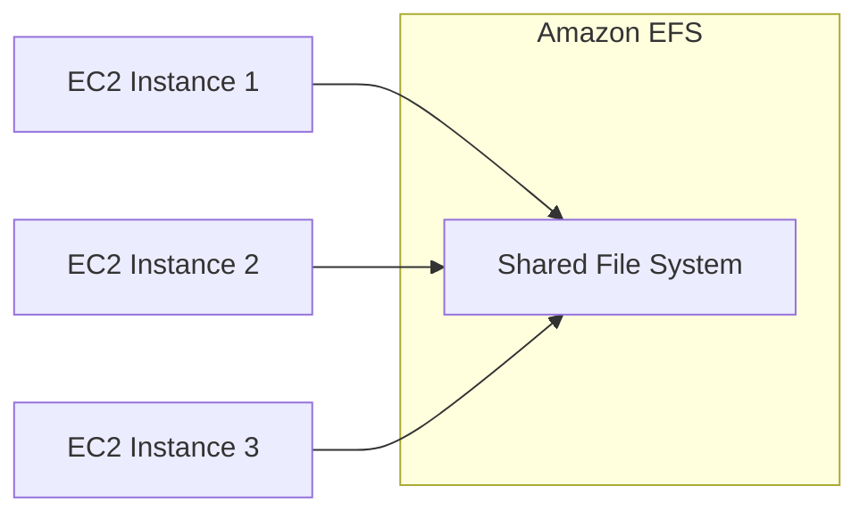
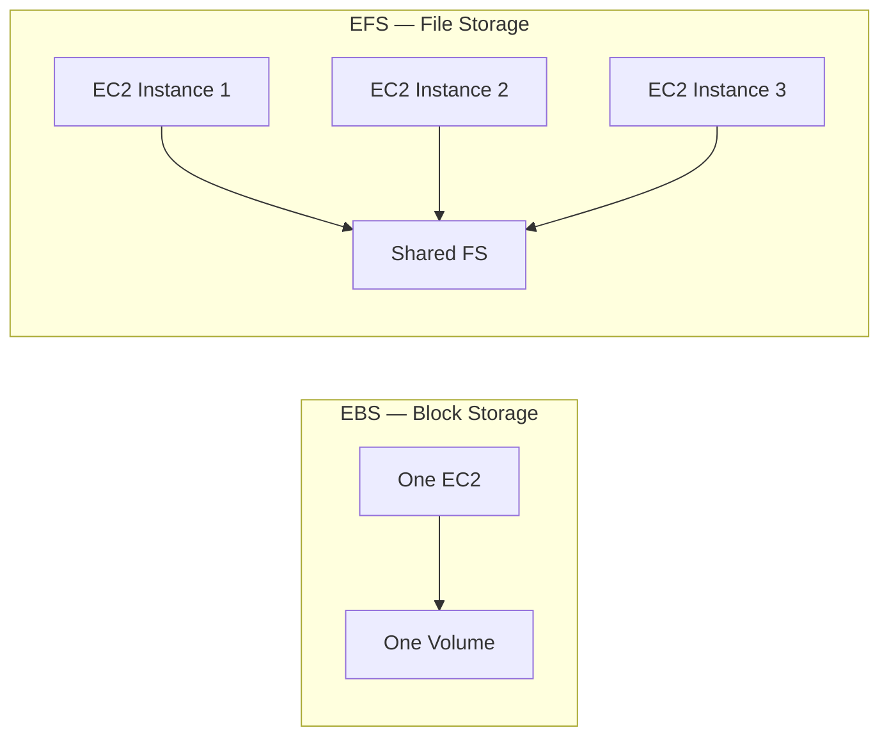
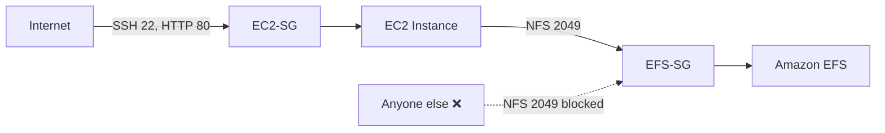
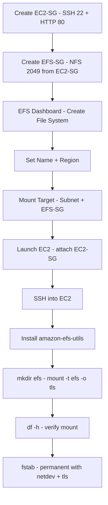

# Day 6: Amazon EFS — Elastic File System
### Hands-on with Floci (Git Bash)

> All CLI commands must be run in **Git Bash**.
> **Docker Desktop** must be running before executing any commands.

📌 **Connect / Social Media:**
[LinkedIn](https://www.linkedin.com/in/asifaowadud) · [YouTube](https://www.youtube.com/@OOAAOW?sub_confirmation=1) · [Telegram](https://t.me/ooaaow) · [Web Lab](https://oao-devops-lab.vercel.app/) · [Facebook](https://www.facebook.com/OOAAOW/)

---

## What You'll Learn Today

- What EFS is and how it differs from EBS
- S3 vs EBS vs EFS — which one to use when
- The two-Security-Group pattern for securing EFS
- Create and manage EFS using Floci CLI
- Mount EFS on real AWS and test shared storage
- Common mistakes and how to fix them

---

## Part 1 — Theory

### What is EFS?

**EFS = Elastic File System**

Amazon EFS is a managed file storage service. It works like a **shared network drive** that multiple EC2 instances can connect to simultaneously.



**Key properties:**
- **Multiple EC2 instances** can connect at the same time (EBS cannot)
- Storage **automatically grows** — no need to pre-provision size
- Redundant across multiple AZs — EBS only lives in one AZ
- Uses NFS protocol

---

### S3 vs EBS vs EFS — Which One When?

| Category | S3 | EBS | EFS |
|----------|----|-----|-----|
| Storage Type | Object Storage | Block Storage | File Storage |
| Pricing | Pay as you Use | Pay for provisioned capacity | Pay as you Use |
| Storage Size | Unlimited | Limited | Unlimited |
| Scalability | Unlimited | Manual increase/decrease | Unlimited Auto |
| Durability | Redundant across multiple AZs | Redundant in a single AZ | Redundant across multiple AZs |
| Availability | 99.99% (S3 Standard) | 99.99% | No SLA |
| Security | Encryption at rest + transit | Encryption at rest + transit | Encryption at rest + transit |
| Backup | Versioning + cross-region | Automated snapshots | EFS-to-EFS replication |
| Performance | Slowest | Fastest | Faster than S3, slower than EBS |
| Accessibility | Public + Private | Only the attached EC2 | Multiple EC2 + on-premises |
| Interface | Web Interface | File System Interface | Web + File System |
| Use Cases | Media, Big data, Backup | Boot volumes, Database, NoSQL | Shared apps, WordPress, Home dir |

---

### EFS vs EBS — Quick Comparison



| Feature | EFS | EBS |
|---------|-----|-----|
| Type | File storage | Block storage |
| Attach | Multiple EC2 | One EC2 |
| Scaling | Automatic | Manual |
| Use case | Shared apps, CMS | Database, OS disk |

---

### The Two-Security-Group Pattern

When setting up EFS, we create two separate Security Groups. This is an important DevOps pattern.

**EC2-SG** — for EC2 instances:
- SSH (22) → from anywhere (your PC)
- HTTP (80) → from anywhere (users)

**EFS-SG** — for EFS:
- NFS (2049) → only from **EC2-SG** (not by IP — by SG identity)



**Why allow by SG identity instead of IP?**

If you allow by IP, every time an instance stops and restarts it gets a new IP — and you'd have to update the rule again. A Security Group is an **identity** — no matter what IP the instance gets, its SG stays the same. So we tell EFS: "Don't check the IP, check the identity."

> **Simple analogy:** Access to a building is granted by a key card — not by name or face. If you have the card, you get in; if you don't, you don't.

---

### Best Practices

| Rule | Why |
|------|-----|
| Allow NFS in EFS-SG only from EC2-SG | IP-based rules break when instances restart |
| Add `-o tls` when mounting | Encryption in transit |
| Use `_netdev` in fstab | Prevents mount before network is ready |
| Use Provisioned Throughput in production | Burst limit causes slowdowns |
| Use EFS Access Points | Fine-grained permission control |

---

## Part 2 — Hands-On with Floci (CLI)

> **Floci EFS support:**
>
> | Command | Floci |
> |---------|-------|
> | `aws efs create-file-system` | ❌ not supported |
> | `aws efs describe-file-systems` | ❌ not supported |
> | `aws efs delete-file-system` | ❌ not supported |
> | `aws efs create-mount-target` | ❌ not supported |
> | Actual mount (inside EC2) | ❌ no real VM |
> | Creating Security Groups | ✅ works |
>
> **Floci internally routes EFS API calls to its S3 handler — resulting in an `InvalidArgument` error.**
> On Day 6, Floci can only be used to practice the **Security Group pattern**. Creating the EFS file system and mounting requires **Real AWS (Part 3)**.

---

### Step 0 — Start Floci

**Why:** Without Floci running, no `aws` command will work.

```bash
floci start --persist ./floci-data
eval $(floci env)
```

**Verify:**
```bash
echo $AWS_ENDPOINT_URL
```

**Expected output:**
```
http://localhost:4566
```

---

### Step 1 — Create the EC2 Security Group

**Why:** We're creating the firewall for EC2 instances — allowing SSH and HTTP. This SG will be used as the source in the EFS security group rule.

```bash
aws ec2 create-security-group \
  --group-name ec2-sg \
  --description "EC2 Security Group - HTTP and SSH"
```

**Expected output:**
```json
{
    "GroupId": "sg-xxxxxxxxxxxxxxxxx"
}
```

**Get the EC2-SG ID:**
```bash
aws ec2 describe-security-groups \
  --query 'SecurityGroups[?GroupName==`ec2-sg`].GroupId' \
  --output text
```

**Allow SSH (22):**
```bash
aws ec2 authorize-security-group-ingress \
  --group-id sg-ec2-xxxxxxx \
  --protocol tcp \
  --port 22 \
  --cidr 0.0.0.0/0
```

**Allow HTTP (80):**
```bash
aws ec2 authorize-security-group-ingress \
  --group-id sg-ec2-xxxxxxx \
  --protocol tcp \
  --port 80 \
  --cidr 0.0.0.0/0
```

**Expected output (for both):**
```json
{
    "Return": true,
    "SecurityGroupRules": [...]
}
```

---

### Step 2 — Create the EFS Security Group

**Why:** A separate SG for EFS — allowing NFS port (2049) only from the EC2-SG, not from any IP. This is the identity-based access pattern.

```bash
aws ec2 create-security-group \
  --group-name efs-sg \
  --description "EFS Security Group - NFS from EC2-SG only"
```

**Expected output:**
```json
{
    "GroupId": "sg-yyyyyyyyyyyyyyyyy"
}
```

**Get the EFS-SG ID:**
```bash
aws ec2 describe-security-groups \
  --query 'SecurityGroups[?GroupName==`efs-sg`].GroupId' \
  --output text
```

**Allow NFS (2049) from EC2-SG only:**

```bash
aws ec2 authorize-security-group-ingress \
  --group-id sg-efs-xxxxxxx \
  --ip-permissions IpProtocol=tcp,FromPort=2049,ToPort=2049,UserIdGroupPairs=[{GroupId=sg-ec2-xxxxxxx}]
```

**Expected output (Floci):**
```json
{
    "Return": true,
    "SecurityGroupRules": [
        {
            "SecurityGroupRuleId": "sgr-xxxxxxxxxxxxxxxxx",
            "GroupId": "sg-efs-xxxxxxx",
            "GroupOwnerId": "000000000000",
            "IsEgress": false,
            "IpProtocol": "tcp",
            "FromPort": 2049,
            "ToPort": 2049
        }
    ]
}
```

**Expected output (Real AWS):**
```json
{
    "Return": true,
    "SecurityGroupRules": [
        {
            "SecurityGroupRuleId": "sgr-xxxxxxxxxxxxxxxxx",
            "GroupId": "sg-efs-xxxxxxx",
            "GroupOwnerId": "123456789012",
            "IsEgress": false,
            "IpProtocol": "tcp",
            "FromPort": 2049,
            "ToPort": 2049,
            "ReferencedGroupInfo": {
                "GroupId": "sg-ec2-xxxxxxx",
                "UserId": "123456789012"
            }
        }
    ]
}
```

> **Floci vs Real AWS:**
> - **Floci:** Returns `Return: true` and port 2049 — rule was created. But `ReferencedGroupInfo` is missing — Floci doesn't support this field.
> - **Real AWS:** Includes `ReferencedGroupInfo: { GroupId: "sg-ec2-xxx" }` — confirms the source is a Security Group identity, not an IP range. This is the correct pattern.

---

### Step 3 — Create the EFS File System

> ⚠️ **This step does not work in Floci.** Floci routes EFS API calls to its S3 handler — results in an `InvalidArgument` error.
> The command and output below are **Real AWS reference only**.

**Why:** This is the main EFS resource — the shared file system that all EC2 instances will connect to.

```bash
aws efs create-file-system \
  --performance-mode generalPurpose \
  --throughput-mode bursting \
  --tags Key=Name,Value=my-efs-demo
```

**Expected output (Real AWS):**
```json
{
    "FileSystemId": "fs-xxxxxxxxxxxxxxxxx",
    "FileSystemArn": "arn:aws:elasticfilesystem:us-east-1:123456789012:file-system/fs-xxxxxxxxx",
    "CreationTime": "2026-07-01T00:00:00+00:00",
    "LifeCycleState": "creating",
    "Name": "my-efs-demo",
    "NumberOfMountTargets": 0,
    "PerformanceMode": "generalPurpose",
    "ThroughputMode": "bursting"
}
```

> **Note the `FileSystemId`:** `fs-xxxxxxxxxxxxxxxxx` — needed for all subsequent commands.

**Verify:**
```bash
aws efs describe-file-systems --output table
```

**Expected output:**
```
------------------------------------------------------------
|                   DescribeFileSystems                    |
+---------------------+------------------------------------+
|  FileSystemId       |  fs-xxxxxxxxxxxxxxxxx              |
|  LifeCycleState     |  available                         |
|  PerformanceMode    |  generalPurpose                    |
|  ThroughputMode     |  bursting                          |
+---------------------+------------------------------------+
```

---

### Step 4 — Create a Mount Target

**Why:** A Mount Target is EFS's "entry point" in a specific subnet. Creating one allows EC2 instances in that subnet to connect to EFS. The EFS-SG is attached here.

```bash
aws efs create-mount-target \
  --file-system-id fs-xxxxxxxxxxxxxxxxx \
  --subnet-id subnet-xxxxxxxxxxxxxxxxx \
  --security-groups sg-efs-xxxxxxx
```

**Expected output (Real AWS):**
```json
{
    "MountTargetId": "fsmt-xxxxxxxxxxxxxxxxx",
    "FileSystemId": "fs-xxxxxxxxxxxxxxxxx",
    "SubnetId": "subnet-xxxxxxxxxxxxxxxxx",
    "LifeCycleState": "creating",
    "IpAddress": "172.31.x.x",
    "NetworkInterfaceId": "eni-xxxxxxxxxxxxxxxxx"
}
```

> ✅ **Steps 3 and 4 complete** — EFS created and Mount Target ready. Proceed to **Part 3** to mount it on EC2.

---

### Step 5 — Delete EFS (Cleanup)

**Why:** Good practice after practice sessions. On real AWS, EFS incurs storage charges.

> **Warning:** All mount targets must be deleted before deleting the file system.

```bash
# Delete mount target first
aws efs delete-mount-target \
  --mount-target-id fsmt-xxxxxxxxxxxxxxxxx

# Then delete the file system
aws efs delete-file-system \
  --file-system-id fs-xxxxxxxxxxxxxxxxx
```

**Expected output:**
```
(no output — this is normal, it means successful)
```

**Verify:**
```bash
aws efs describe-file-systems
```

**Expected output:**
```json
{
    "FileSystems": []
}
```

---

## Part 3 — Mounting EFS in Real AWS (Reference)

> **When to start this section:** After Step 3 and Step 4 (EFS created + Mount Target created) are complete.
>
> This section does not apply to Floci. Follow these steps with a real AWS Free Tier EC2 instance.

---

### Launch EC2 and Mount EFS on Real AWS

**1. Launch an EC2 instance (attach EC2-SG):**

```bash
aws ec2 run-instances \
  --image-id ami-xxxxxxxxx \
  --instance-type t2.micro \
  --key-name my-ec2-key \
  --security-group-ids sg-ec2-xxxxxxx \
  --count 1
```

**2. SSH into the instance:**

```bash
chmod 400 my-ec2-key.pem
ssh -i my-ec2-key.pem ec2-user@YOUR_PUBLIC_IP
```

**3. Install the EFS client:**

**Why:** Without the `amazon-efs-utils` package, `mount -t efs` will not work. This package is purpose-built for EFS — it handles TLS encryption and automatic retries.

**Amazon Linux:**
```bash
sudo yum install amazon-efs-utils -y
```

**Ubuntu:**
```bash
sudo apt update
sudo apt install nfs-common -y
```

**4. Create the mount directory:**

**Why:** EFS must be connected to a directory — `/efs` is that entry point.

```bash
sudo mkdir /efs
```

**5. Mount EFS:**

**Why:** This command connects the EC2 instance to EFS over the network. The `-o tls` flag encrypts all data in transit.

```bash
sudo mount -t efs -o tls fs-xxxxxxxxxxxxxxxxx:/ /efs
```

**6. Verify:**

```bash
df -h
```

**Expected output:**
```
Filesystem        Size  Used Avail Use% Mounted on
127.0.0.1:/       8.0E     0  8.0E   0% /efs
```

> `8.0E` (8 Exabytes) is shown because EFS is unlimited — AWS reports it this way.

---

### Test — Verify Shared Storage

**7. Create a file:**

```bash
cd /efs
sudo touch shared-file.txt
ls
```

**Expected output:**
```
shared-file.txt
```

**8. Check from a second EC2 instance (shared storage proof):**

On a second EC2 instance (after mounting the same EFS):

```bash
ls /efs
```

**Expected output:**
```
shared-file.txt   ← file created on instance 1 is visible on instance 2 ✅
```

---

### Add a New Instance to an Existing EFS

> **Scenario:** EFS is already created and two instances are already connected. Now you're launching a third new instance and want to mount the same EFS — so it immediately sees all the shared files.

**What you do NOT need:**
- No new EFS to create
- No new Mount Target (if staying in the same AZ/subnet)
- No existing data is touched

**Just do these steps:**

**1. Launch the new EC2 — attach EC2-SG:**

```bash
aws ec2 run-instances \
  --image-id ami-xxxxxxxxx \
  --instance-type t2.micro \
  --key-name my-ec2-key \
  --security-group-ids sg-ec2-xxxxxxx \
  --count 1
```

> As long as EC2-SG is attached, the EFS-SG NFS rule already allows it — no extra permission needed.

**2. SSH in and install EFS client:**

```bash
ssh -i my-ec2-key.pem ec2-user@NEW_INSTANCE_PUBLIC_IP
sudo yum install amazon-efs-utils -y
```

**3. Mount using the same EFS ID:**

```bash
sudo mkdir /efs
sudo mount -t efs -o tls fs-xxxxxxxxxxxxxxxxx:/ /efs
```

**4. Verify — can you see the files from the other instances:**

```bash
ls /efs
```

**Expected output:**
```
shared-file.txt   ← file created on another instance is visible on the new one too ✅
```

> This is EFS's core power — **create EFS once, any number of instances can join at any time.**

---

### Make the Mount Permanent (Reboot-proof)

**Why:** Without an fstab entry, the mount is lost after a restart. `_netdev` ensures EFS is mounted only after the network is ready — otherwise the boot can fail.

```bash
sudo nano /etc/fstab
```

Add:
```
fs-xxxxxxxxxxxxxxxxx:/ /efs efs defaults,_netdev,tls 0 0
```

**Test:**
```bash
sudo mount -a
```

**Expected output:**
```
(no output — this is normal, it means fstab is correct)
```

---

## Real DevOps Use Cases

| Use Case | How |
|----------|-----|
| WordPress multi-server | Multiple web servers share the same `/var/www/html` |
| Kubernetes shared volume | EFS as Persistent Volume Claim |
| CI/CD shared workspace | Jenkins agents share the same workspace |
| Home directories | All users' home dirs on EFS — accessible from any server |

---

## Common Mistakes and Solutions

| Mistake | What Happens | Fix |
|---------|-------------|-----|
| Port 2049 not open | Mount hangs, times out | Allow NFS (2049) in EFS-SG |
| EFS and EC2 in different VPCs | Cannot connect | Use the same VPC |
| No mount target in the subnet | Connection refused | Create a mount target in the correct subnet |
| `amazon-efs-utils` not installed | `unknown filesystem type 'efs'` | `yum install amazon-efs-utils -y` |
| Missing `_netdev` in fstab | Mount runs before network, boot fails | Use `defaults,_netdev,tls` |
| Deleting EFS before mount targets | `FileSystemInUse` error | Delete mount targets first, then the file system |

---

## Quick Reference — EFS CLI Cheat Sheet

| Command | What It Does |
|---------|-------------|
| `aws efs create-file-system --performance-mode generalPurpose --throughput-mode bursting` | Create EFS |
| `aws efs describe-file-systems` | List all EFS file systems |
| `aws efs create-mount-target --file-system-id <fs-id> --subnet-id <subnet> --security-groups <sg>` | Create mount target |
| `aws efs delete-mount-target --mount-target-id <fsmt-id>` | Delete mount target |
| `aws efs delete-file-system --file-system-id <fs-id>` | Delete EFS |
| `sudo yum install amazon-efs-utils -y` | Install EFS client (Amazon Linux) |
| `sudo mount -t efs -o tls fs-xxxx:/ /efs` | Mount EFS (Real AWS) |
| `df -h` | Verify mount |

---

## Real AWS Console Flow (Reference)

**Quick summary:**
`Create EC2-SG - Create EFS-SG - EFS Dashboard - Create File System - Mount Target - Launch EC2 - SSH - Install EFS Utils - Mount - fstab`

<details>
<summary>📊 Click to expand visual diagram</summary>



</details>

---

## What You Built Today

```
EFS Setup (Floci CLI + Real AWS)
├── EC2-SG           → SSH 22 + HTTP 80 (anywhere)
├── EFS-SG           → NFS 2049 (from EC2-SG only — identity-based)
├── EFS File System  → fs-xxxxxxxxx (generalPurpose, bursting)
│   └── Mount Target → subnet + EFS-SG attached
├── EC2 Instance     → EC2-SG attached
└── Real AWS Reference
    ├── amazon-efs-utils installed
    ├── mount -t efs -o tls → /efs
    ├── shared-file.txt → visible on second instance
    └── fstab → _netdev + tls permanent
```

---

## Homework

1. Launch two EC2 instances. Mount the same EFS on both. Create a file on one — verify it appears on the other.
2. Try allowing NFS in EFS-SG by IP (`0.0.0.0/0`), then switch to SG-based. What is the difference in practice?
3. On real AWS: add the fstab entry, restart the instance — does `/efs` mount automatically?

---

## Resources

- Floci official: [https://floci.io](https://floci.io)
- Floci AWS services: [https://floci.io/aws](https://floci.io/aws)
- AWS EFS CLI Reference: [https://docs.aws.amazon.com/cli/latest/reference/efs/](https://docs.aws.amazon.com/cli/latest/reference/efs/)
- AWS EFS User Guide: [https://docs.aws.amazon.com/efs/latest/ug/](https://docs.aws.amazon.com/efs/latest/ug/)
