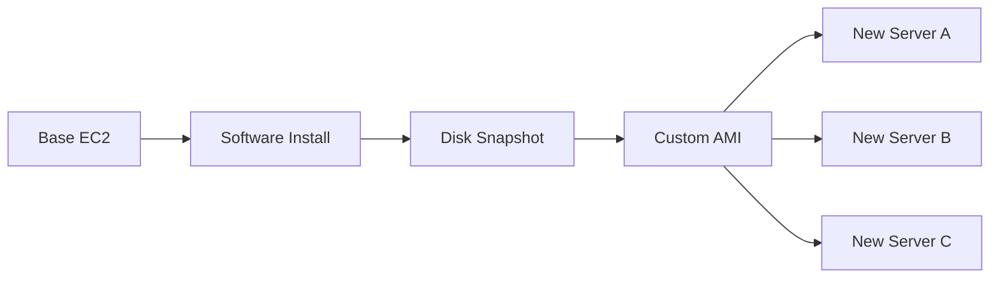
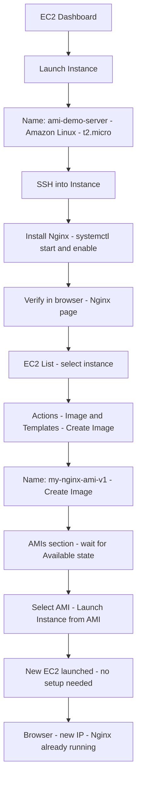

# Day 7: AMI — Amazon Machine Image

### Floci দিয়ে হাতে-কলমে শেখো (Git Bash)

> সব কমান্ড **Git Bash**-এ রান করতে হবে।
> কমান্ড রান করার আগে **Docker Desktop** অবশ্যই চালু থাকতে হবে।

📌 **যোগাযোগ / সোশ্যাল মিডিয়া:**
[LinkedIn](https://www.linkedin.com/in/asifaowadud) · [YouTube](https://www.youtube.com/@OOAAOW?sub_confirmation=1) · [Telegram](https://t.me/ooaaow) · [Web Lab](https://oao-devops-lab.vercel.app/) · [Facebook](https://www.facebook.com/OOAAOW/)

---

## পার্ট ১ — তত্ত্ব (Theory)

### AMI কী?

> **AMI (Amazon Machine Image)** হলো একটি pre-configured template, যেটা দিয়ে EC2 instance launch করা হয়।

AMI-তে কী কী থাকে:

| উপাদান | বিবরণ |
|--------|--------|
| Operating System | Amazon Linux, Ubuntu, Windows ইত্যাদি |
| Installed Software | Nginx, Node.js, Java — যা তুমি install করেছ |
| Configuration | Environment variables, system settings |
| EBS Snapshot | ডিস্কের পুরো state — সব data সহ |

**উদাহরণ:** Nginx install করলে → তার থেকে AMI বানালে → সেই AMI দিয়ে ১০০টা server তৈরি করলে প্রতিটায় Nginx already installed।

---

### কেন AMI দরকার? (DevOps দৃষ্টিকোণ)

| সমস্যা (AMI ছাড়া) | সমাধান (AMI দিয়ে) |
|-------------------|-------------------|
| প্রতিটা server-এ আলাদা করে software install করতে হয় | একবার install → AMI বানাও → সব server-এ ready |
| "Dev-এ কাজ করে, prod-এ করে না" | একই AMI থেকে launch = একই environment |
| Server crash হলে সব হারিয়ে যায় | AMI থেকে মুহূর্তে restore |
| Auto Scaling-এ নতুন server configure করতে সময় লাগে | AMI থেকে seconds-এ নতুন server |

Real-world tools যেখানে AMI ব্যবহার হয়:
- **Terraform:** `aws_ami` resource দিয়ে infrastructure-as-code
- **Jenkins:** Build server AMI বানিয়ে CI/CD pipeline-এ reuse
- **Auto Scaling Group:** Traffic বাড়লে AMI থেকে স্বয়ংক্রিয়ভাবে নতুন instance

---

### AMI Workflow



---

### AMI-র ধরন

| ধরন | বিবরণ | উদাহরণ |
|-----|--------|---------|
| **Public AMI** | AWS এবং community তৈরি, সবাই ব্যবহার করতে পারে | Amazon Linux 2, Ubuntu 22.04 |
| **Private AMI** | তোমার নিজের তৈরি, শুধু তোমার account-এ দেখা যায় | my-nginx-ami |
| **Marketplace AMI** | Third-party vendor তৈরি, কিছু paid | WordPress pre-installed, CentOS |

---

### Golden Image কী?

DevOps-এ **"Golden Image"** বলা হয় সেই AMI-কে যেটা:
- সব security patch আপডেট করা
- সব প্রয়োজনীয় software pre-installed
- টিমের সবাই এই একটা image থেকেই server তৈরি করে

**চিন্তা করো:** কোম্পানির ৫০০টা server এক AMI থেকে — নতুন security patch দিতে হলে শুধু AMI update করো, তারপর নতুন servers deploy।

---

### Best Practices

| Rule | কারণ |
|------|------|
| Software install শেষে, verify করার পর AMI বানাও | Incomplete state capture করো না |
| AMI-র নামে version দাও (`nginx-v1.2`) | কোন version সেটা ভবিষ্যতে বোঝা যাবে |
| Region মিলিয়ে দেখো | AMI region-specific — us-east-1-এর AMI ap-south-1-এ দেখা যাবে না |
| পুরনো AMI deregister করো | EBS snapshot storage cost বাঁচাবে |
| `--no-reboot` সাবধানে ব্যবহার করো | Reboot না করলে disk inconsistency হতে পারে |

---

## পার্ট ২ — Floci দিয়ে হাতে-কলমে (CLI)

> **Floci-তে AMI support:**
>
> | কমান্ড | Floci |
> |--------|-------|
> | `aws ec2 run-instances` (base instance) | ✅ Instance record তৈরি |
> | `aws ec2 create-image` | ✅ AMI record তৈরি |
> | `aws ec2 describe-images --owners self` | ✅ কাজ করে |
> | `aws ec2 deregister-image` | ✅ কাজ করে |
> | SSH করে software install করা | ❌ Real VM নেই |
> | AMI-তে pre-installed software capture | ❌ Real disk snapshot হয় না |
>
> Floci-তে AMI-র পুরো CLI workflow (create, describe, launch, delete) practice করা যাবে।
> Software install এবং verify করতে হবে **Real AWS-এ (পার্ট ৩)**।

---

### ধাপ ০ — Floci চালু করো

**কেন করছি?** Floci না চালালে সব AWS CLI command fail করবে।

```bash
floci start --persist ./floci-data
eval $(floci env)
echo $AWS_ENDPOINT_URL
```

**প্রত্যাশিত output:**
```
http://localhost:4566
```

---

### ধাপ ১ — Base EC2 Instance তৈরি করো

**কেন করছি?** AMI বানাতে হলে প্রথমে একটি running instance লাগে — এটাই আমাদের base server যেটা থেকে AMI তৈরি হবে।

```bash
aws ec2 run-instances \
  --image-id ami-12345678 \
  --instance-type t2.micro \
  --count 1 \
  --tag-specifications 'ResourceType=instance,Tags=[{Key=Name,Value=ami-demo-server}]'
```

**প্রত্যাশিত output:**
```json
{
    "Instances": [
        {
            "InstanceId": "i-xxxxxxxxxxxxxxxxx",
            "ImageId": "ami-12345678",
            "InstanceType": "t2.micro",
            "State": {
                "Name": "running"
            },
            "Tags": [
                {
                    "Key": "Name",
                    "Value": "ami-demo-server"
                }
            ]
        }
    ]
}
```

**Instance ID সংরক্ষণ করো:**
```bash
aws ec2 describe-instances \
  --filters "Name=tag:Name,Values=ami-demo-server" \
  --query 'Reservations[0].Instances[0].InstanceId' \
  --output text
```

**প্রত্যাশিত output:**
```
i-xxxxxxxxxxxxxxxxx
```

---

### ধাপ ২ — Software Install (Nginx)

> ⚠️ **Floci-তে এই ধাপ সম্ভব নয়।** Floci real VM চালায় না — SSH করা যায় না, software install করা যায় না।
> এই ধাপের জন্য **পার্ট ৩ (Real AWS), ধাপ ২-৩**-এ যাও।

Real AWS-এ এখানে যা করতে হত (reference):
```bash
ssh -i my-key.pem ec2-user@YOUR_PUBLIC_IP
sudo amazon-linux-extras install nginx1 -y
sudo systemctl start nginx
sudo systemctl enable nginx
```

---

### ধাপ ৩ — AMI তৈরি করো

**কেন করছি?** Running instance-এর disk state capture করে AMI বানাচ্ছি। এই AMI থেকে পরে নতুন server তৈরি করলে সব software already installed থাকবে।

```bash
aws ec2 create-image \
  --instance-id i-xxxxxxxxxxxxxxxxx \
  --name "my-custom-ami" \
  --description "Nginx pre-installed" \
  --no-reboot
```

**প্রত্যাশিত output:**
```json
{
    "ImageId": "ami-yyyyyyyyyyyyyyyyy"
}
```

---

### ধাপ ৪ — AMI যাচাই করো

**কেন করছি?** AMI তৈরি হয়েছে কিনা এবং তার ID কী সেটা confirm করছি।

```bash
aws ec2 describe-images --owners self
```

**প্রত্যাশিত output:**
```json
{
    "Images": [
        {
            "ImageId": "ami-yyyyyyyyyyyyyyyyy",
            "Name": "my-custom-ami",
            "Description": "Nginx pre-installed",
            "State": "available",
            "OwnerId": "000000000000",
            "CreationDate": "2026-07-01T00:00:00+00:00"
        }
    ]
}
```

---

### ধাপ ৫ — Custom AMI থেকে নতুন EC2 Launch করো

**কেন করছি?** এটাই AMI-র মূল ব্যবহার — custom AMI দিয়ে নতুন server তৈরি। Real AWS-এ এই নতুন server-এ Nginx already installed থাকত — কোনো কনফিগারেশন ছাড়াই।

```bash
aws ec2 run-instances \
  --image-id ami-yyyyyyyyyyyyyyyyy \
  --instance-type t2.micro \
  --count 1 \
  --tag-specifications 'ResourceType=instance,Tags=[{Key=Name,Value=from-custom-ami}]'
```

**প্রত্যাশিত output:**
```json
{
    "Instances": [
        {
            "InstanceId": "i-zzzzzzzzzzzzzzzzz",
            "ImageId": "ami-yyyyyyyyyyyyyyyyy",
            "State": {
                "Name": "running"
            }
        }
    ]
}
```

---

### ধাপ ৬ — Cleanup

**কেন করছি?** Practice শেষে তৈরি resources মুছে রাখা ভালো অভ্যাস। Real AWS-এ AMI-র সাথে EBS snapshot থাকে — মুছলে snapshot-ও মোছা দরকার।

```bash
# AMI deregister করো
aws ec2 deregister-image --image-id ami-yyyyyyyyyyyyyyyyy

# Instance terminate করো
aws ec2 terminate-instances \
  --instance-ids i-xxxxxxxxxxxxxxxxx i-zzzzzzzzzzzzzzzzz
```

**প্রত্যাশিত output:**
```
(কোনো output আসবে না — এটা স্বাভাবিক, মানে সফল হয়েছে)
```

**যাচাই করো:**
```bash
aws ec2 describe-images --owners self
```

**প্রত্যাশিত output:**
```json
{
    "Images": []
}
```

---

## পার্ট ৩ — Real AWS-এ AMI তৈরি ও ব্যবহার (Reference)

> **কখন করবে:** একটি real AWS Free Tier EC2 instance চালু করার পর এই section শুরু হয়।
>
> এই section Floci-তে কাজ করবে না। Real AWS account-এ EC2 চালিয়ে এই steps follow করো।

---

### ধাপ ১ — Base EC2 Launch করো

```bash
aws ec2 run-instances \
  --image-id ami-0c02fb55956c7d316 \
  --instance-type t2.micro \
  --key-name my-ec2-key \
  --security-group-ids sg-xxxxxxxxx \
  --tag-specifications 'ResourceType=instance,Tags=[{Key=Name,Value=ami-demo-server}]'
```

---

### ধাপ ২ — SSH দিয়ে EC2-তে ঢোকো

```bash
chmod 400 my-ec2-key.pem
ssh -i my-ec2-key.pem ec2-user@YOUR_PUBLIC_IP
```

---

### ধাপ ৩ — Nginx Install করো

**কেন করছি?** এই Nginx installation-টাই AMI-তে capture হবে — পরবর্তী server-এ আপনাআপনি থাকবে, আর install করতে হবে না।

**Amazon Linux 2-এ:**
```bash
sudo amazon-linux-extras install nginx1 -y
sudo systemctl start nginx
sudo systemctl enable nginx
```

**Amazon Linux 2023-এ:**
```bash
sudo dnf install nginx -y
sudo systemctl start nginx
sudo systemctl enable nginx
```

**যাচাই করো:**
```bash
sudo systemctl status nginx
```

**প্রত্যাশিত output:**
```
● nginx.service - The nginx HTTP and reverse proxy server
     Active: active (running)
```

ব্রাউজারে দেখো: `http://YOUR_PUBLIC_IP` → Nginx welcome page আসবে ✅

---

### ধাপ ৪ — AMI তৈরি করো

**কেন করছি?** Nginx-সহ instance-এর disk state capture করছি।

```bash
INSTANCE_ID=$(aws ec2 describe-instances \
  --filters "Name=tag:Name,Values=ami-demo-server" \
  --query 'Reservations[0].Instances[0].InstanceId' \
  --output text)

aws ec2 create-image \
  --instance-id $INSTANCE_ID \
  --name "my-nginx-ami-v1" \
  --description "Nginx pre-installed on Amazon Linux" \
  --no-reboot
```

**প্রত্যাশিত output:**
```json
{
    "ImageId": "ami-yyyyyyyyyyyyyyyyy"
}
```

**AMI available হওয়া পর্যন্ত অপেক্ষা করো:**
```bash
aws ec2 wait image-available --image-ids ami-yyyyyyyyyyyyyyyyy
echo "AMI ready!"
```

---

### ধাপ ৫ — Custom AMI থেকে নতুন EC2 Launch করো

**কেন করছি?** এই নতুন server-এ কোনো কনফিগারেশন লাগবে না — Nginx already AMI-তে capture করা আছে।

```bash
aws ec2 run-instances \
  --image-id ami-yyyyyyyyyyyyyyyyy \
  --instance-type t2.micro \
  --key-name my-ec2-key \
  --security-group-ids sg-xxxxxxxxx \
  --count 1 \
  --tag-specifications 'ResourceType=instance,Tags=[{Key=Name,Value=from-nginx-ami}]'
```

---

### ধাপ ৬ — নতুন Server যাচাই করো

নতুন instance-এর public IP নিয়ে ব্রাউজারে দেখো:

```
http://NEW_PUBLIC_IP
```

**Nginx already running ✅ — একটুও install করতে হয়নি।**

এটাই AMI-র শক্তি।

---

## দ্রুত তথ্যসূত্র — AMI কমান্ড চিট শিট

| কমান্ড | কী করে |
|--------|--------|
| `aws ec2 create-image --instance-id i-xxx --name "name" --no-reboot` | Instance থেকে AMI তৈরি |
| `aws ec2 describe-images --owners self` | তোমার তৈরি সব AMI দেখো |
| `aws ec2 describe-images --image-ids ami-xxx` | নির্দিষ্ট AMI-র details |
| `aws ec2 run-instances --image-id ami-xxx` | AMI থেকে EC2 launch |
| `aws ec2 deregister-image --image-id ami-xxx` | AMI মুছো |
| `aws ec2 wait image-available --image-ids ami-xxx` | AMI available হওয়া পর্যন্ত অপেক্ষা |
| `aws ec2 copy-image --source-image-id ami-xxx --source-region us-east-1 --region ap-south-1 --name "copy"` | AMI অন্য region-এ copy |

---

## Real AWS Console-এ ফ্লো (রেফারেন্স)

**সংক্ষেপে:**
`EC2 Dashboard → Launch Instance → SSH → Install Nginx → Verify → Select Instance → Actions → Image and Templates → Create Image → AMIs → Available → Launch Instance from AMI → New server, Nginx already running`

<details>
<summary>📊 বিস্তারিত ভিজ্যুয়াল ডায়াগ্রাম দেখতে ক্লিক করো</summary>



</details>

---

## আজকে যা তৈরি করলে

```
Day7-AMI-floci/
├── Base EC2 (ami-demo-server)          ← Floci + Real AWS
├── Custom AMI (my-custom-ami)          ← Floci + Real AWS
└── New EC2 from AMI (from-custom-ami)  ← Floci + Real AWS
```

| তৈরি | Floci | Real AWS |
|------|-------|----------|
| Base EC2 launch | ✅ | ✅ |
| AMI record তৈরি | ✅ | ✅ |
| Custom AMI থেকে EC2 | ✅ | ✅ |
| Nginx install ও verify | ❌ | ✅ |
| Pre-installed software proof | ❌ | ✅ |

---

## বাড়ির কাজ

১. Floci-তে একটি AMI তৈরি করো এবং সেটা থেকে ৩টি নতুন instance launch করো।
২. Real AWS-এ Nginx-এর বদলে Apache httpd install করে AMI বানাও — নতুন instance-এ verify করো (`http://IP` → Apache page)।
৩. `describe-images --owners self` দিয়ে AMI-র `ImageId` বের করার command লিখো এবং সেটা variable-এ store করো।

---

## রিসোর্স

- Floci: https://floci.io
- Floci AWS services: https://floci.io/aws
- AWS AMI docs: https://docs.aws.amazon.com/AWSEC2/latest/UserGuide/AMIs.html
- AWS create-image CLI: https://docs.aws.amazon.com/cli/latest/reference/ec2/create-image.html
