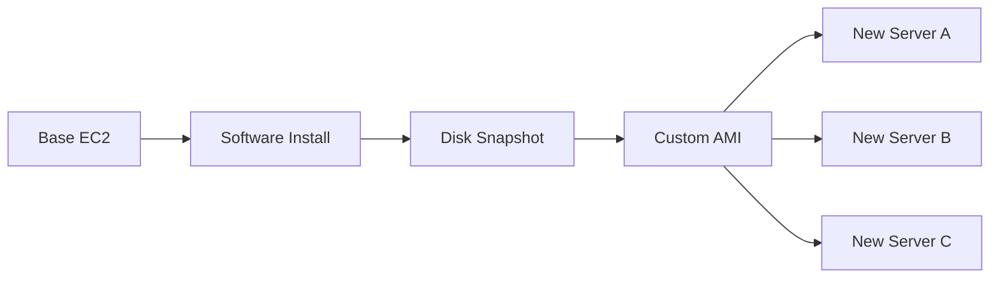
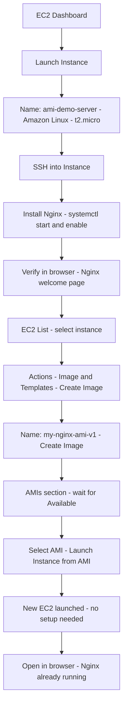

# Day 7: AMI — Amazon Machine Image

### Hands-On Learning with Floci (Git Bash)

> All commands must be run in **Git Bash**.
> **Docker Desktop** must be running before executing any commands.

📌 **Connect / Social Media:**
[LinkedIn](https://www.linkedin.com/in/asifaowadud) · [YouTube](https://www.youtube.com/@OOAAOW?sub_confirmation=1) · [Telegram](https://t.me/ooaaow) · [Web Lab](https://oao-devops-lab.vercel.app/) · [Facebook](https://www.facebook.com/OOAAOW/)

---

## Part 1 — Theory

### What is an AMI?

> An **AMI (Amazon Machine Image)** is a pre-configured template used to launch EC2 instances.

What an AMI contains:

| Component | Description |
|-----------|-------------|
| Operating System | Amazon Linux, Ubuntu, Windows, etc. |
| Installed Software | Nginx, Node.js, Java — whatever you installed |
| Configuration | Environment variables, system settings |
| EBS Snapshot | Full disk state — all data included |

**Example:** Install Nginx → create AMI → use that AMI to launch 100 servers → Nginx is already installed on every one of them.

---

### Why AMI Matters (DevOps Perspective)

| Problem (without AMI) | Solution (with AMI) |
|----------------------|---------------------|
| Install software on every new server manually | Install once → create AMI → all servers ready |
| "Works on dev, not on prod" | Same AMI = same environment everywhere |
| Server crashes → everything lost | Restore from AMI in minutes |
| Auto Scaling takes time to configure new servers | AMI → new server in seconds |

Real-world tools that use AMIs:
- **Terraform:** `aws_ami` resource for infrastructure-as-code
- **Jenkins:** Build server AMI reused across CI/CD pipelines
- **Auto Scaling Group:** Automatically launches new instances from AMI when traffic spikes

---

### AMI Workflow



---

### Types of AMI

| Type | Description | Example |
|------|-------------|---------|
| **Public AMI** | Provided by AWS and community, usable by anyone | Amazon Linux 2, Ubuntu 22.04 |
| **Private AMI** | Your own custom build, visible only in your account | my-nginx-ami |
| **Marketplace AMI** | Third-party vendor, some are paid | WordPress pre-installed, CentOS |

---

### What is a Golden Image?

In DevOps, a **"Golden Image"** is an AMI that:
- Has all security patches applied
- Has all required software pre-installed
- Is the single source of truth — every team member launches servers from this one image

**Think about it:** Your company has 500 servers all launched from one AMI. When a security patch is needed, update the AMI and redeploy — no manual patching on 500 servers.

---

### Best Practices

| Rule | Why |
|------|-----|
| Build the AMI after all software is installed and verified | Never capture an incomplete state |
| Include version in the AMI name (`nginx-v1.2`) | Makes it easy to track which version is deployed |
| Always check the region | AMIs are region-specific — an AMI in us-east-1 is not visible in ap-south-1 |
| Deregister old AMIs | Attached EBS snapshots incur storage costs |
| Use `--no-reboot` carefully | Skipping reboot can cause disk inconsistency in real workloads |

---

## Part 2 — Hands-On with Floci (CLI)

> **Floci AMI support:**
>
> | Command | Floci |
> |---------|-------|
> | `aws ec2 run-instances` (base instance) | ✅ Creates instance record |
> | `aws ec2 create-image` | ✅ Creates AMI record |
> | `aws ec2 describe-images --owners self` | ✅ Works |
> | `aws ec2 deregister-image` | ✅ Works |
> | SSH and install software | ❌ No real VM |
> | Capture pre-installed software in AMI | ❌ No real disk snapshot |
>
> In Floci you can practice the full AMI CLI workflow (create, describe, launch, delete).
> Software installation and verification must be done in **Real AWS (Part 3)**.

---

### Step 0 — Start Floci

**Why:** Floci must be running before any AWS CLI commands will work.

```bash
floci start --persist ./floci-data
eval $(floci env)
echo $AWS_ENDPOINT_URL
```

**Expected output:**
```
http://localhost:4566
```

---

### Step 1 — Launch a Base EC2 Instance

**Why:** An AMI requires a running instance to capture from. This is the base server we'll build on.

```bash
aws ec2 run-instances \
  --image-id ami-12345678 \
  --instance-type t2.micro \
  --count 1 \
  --tag-specifications 'ResourceType=instance,Tags=[{Key=Name,Value=ami-demo-server}]'
```

**Expected output:**
```json
{
    "Instances": [
        {
            "InstanceId": "i-xxxxxxxxxxxxxxxxx",
            "ImageId": "ami-12345678",
            "InstanceType": "t2.micro",
            "State": {
                "Name": "running"
            },
            "Tags": [
                {
                    "Key": "Name",
                    "Value": "ami-demo-server"
                }
            ]
        }
    ]
}
```

**Save the Instance ID:**
```bash
aws ec2 describe-instances \
  --filters "Name=tag:Name,Values=ami-demo-server" \
  --query 'Reservations[0].Instances[0].InstanceId' \
  --output text
```

**Expected output:**
```
i-xxxxxxxxxxxxxxxxx
```

---

### Step 2 — Install Software (Nginx)

> ⚠️ **This step is not possible in Floci.** Floci does not run real VMs — SSH and software installation are not supported.
> Go to **Part 3 (Real AWS), Steps 2–3** for this.

For reference, this is what you'd run on Real AWS:
```bash
ssh -i my-key.pem ec2-user@YOUR_PUBLIC_IP
sudo amazon-linux-extras install nginx1 -y
sudo systemctl start nginx
sudo systemctl enable nginx
```

---

### Step 3 — Create the AMI

**Why:** We're capturing the disk state of the running instance as an AMI. Any server launched from this AMI will have all the same software already installed.

```bash
aws ec2 create-image \
  --instance-id i-xxxxxxxxxxxxxxxxx \
  --name "my-custom-ami" \
  --description "Nginx pre-installed" \
  --no-reboot
```

**Expected output:**
```json
{
    "ImageId": "ami-yyyyyyyyyyyyyyyyy"
}
```

---

### Step 4 — Verify the AMI

**Why:** Confirming the AMI was created and noting its ID for the next step.

```bash
aws ec2 describe-images --owners self
```

**Expected output:**
```json
{
    "Images": [
        {
            "ImageId": "ami-yyyyyyyyyyyyyyyyy",
            "Name": "my-custom-ami",
            "Description": "Nginx pre-installed",
            "State": "available",
            "OwnerId": "000000000000",
            "CreationDate": "2026-07-01T00:00:00+00:00"
        }
    ]
}
```

---

### Step 5 — Launch a New EC2 from Your Custom AMI

**Why:** This is the core power of AMI — launch a new server from your custom image. On Real AWS, Nginx would already be running on this new server with zero configuration.

```bash
aws ec2 run-instances \
  --image-id ami-yyyyyyyyyyyyyyyyy \
  --instance-type t2.micro \
  --count 1 \
  --tag-specifications 'ResourceType=instance,Tags=[{Key=Name,Value=from-custom-ami}]'
```

**Expected output:**
```json
{
    "Instances": [
        {
            "InstanceId": "i-zzzzzzzzzzzzzzzzz",
            "ImageId": "ami-yyyyyyyyyyyyyyyyy",
            "State": {
                "Name": "running"
            }
        }
    ]
}
```

---

### Step 6 — Cleanup

**Why:** Good practice to clean up after a session. On Real AWS, AMIs have attached EBS snapshots that continue to incur storage costs.

```bash
# Deregister the AMI
aws ec2 deregister-image --image-id ami-yyyyyyyyyyyyyyyyy

# Terminate both instances
aws ec2 terminate-instances \
  --instance-ids i-xxxxxxxxxxxxxxxxx i-zzzzzzzzzzzzzzzzz
```

**Expected output:**
```
(no output — this is normal, it means successful)
```

**Verify:**
```bash
aws ec2 describe-images --owners self
```

**Expected output:**
```json
{
    "Images": []
}
```

---

## Part 3 — AMI in Real AWS (Reference)

> **When to start this section:** After launching a real AWS Free Tier EC2 instance.
>
> This section does not apply to Floci. Follow these steps with a real AWS account.

---

### Step 1 — Launch the Base EC2

```bash
aws ec2 run-instances \
  --image-id ami-0c02fb55956c7d316 \
  --instance-type t2.micro \
  --key-name my-ec2-key \
  --security-group-ids sg-xxxxxxxxx \
  --tag-specifications 'ResourceType=instance,Tags=[{Key=Name,Value=ami-demo-server}]'
```

---

### Step 2 — SSH into the Instance

```bash
chmod 400 my-ec2-key.pem
ssh -i my-ec2-key.pem ec2-user@YOUR_PUBLIC_IP
```

---

### Step 3 — Install Nginx

**Why:** This Nginx installation is what gets captured in the AMI — every future server launched from it will have Nginx already running.

**On Amazon Linux 2:**
```bash
sudo amazon-linux-extras install nginx1 -y
sudo systemctl start nginx
sudo systemctl enable nginx
```

**On Amazon Linux 2023:**
```bash
sudo dnf install nginx -y
sudo systemctl start nginx
sudo systemctl enable nginx
```

**Verify:**
```bash
sudo systemctl status nginx
```

**Expected output:**
```
● nginx.service - The nginx HTTP and reverse proxy server
     Active: active (running)
```

Open in browser: `http://YOUR_PUBLIC_IP` → Nginx welcome page ✅

---

### Step 4 — Create the AMI

**Why:** Capturing the disk state with Nginx installed.

```bash
INSTANCE_ID=$(aws ec2 describe-instances \
  --filters "Name=tag:Name,Values=ami-demo-server" \
  --query 'Reservations[0].Instances[0].InstanceId' \
  --output text)

aws ec2 create-image \
  --instance-id $INSTANCE_ID \
  --name "my-nginx-ami-v1" \
  --description "Nginx pre-installed on Amazon Linux" \
  --no-reboot
```

**Expected output:**
```json
{
    "ImageId": "ami-yyyyyyyyyyyyyyyyy"
}
```

**Wait for AMI to become available:**
```bash
aws ec2 wait image-available --image-ids ami-yyyyyyyyyyyyyyyyy
echo "AMI ready!"
```

---

### Step 5 — Launch a New EC2 from the Custom AMI

**Why:** This new server needs zero configuration — Nginx is already baked into the AMI.

```bash
aws ec2 run-instances \
  --image-id ami-yyyyyyyyyyyyyyyyy \
  --instance-type t2.micro \
  --key-name my-ec2-key \
  --security-group-ids sg-xxxxxxxxx \
  --count 1 \
  --tag-specifications 'ResourceType=instance,Tags=[{Key=Name,Value=from-nginx-ami}]'
```

---

### Step 6 — Verify the New Server

Get the new instance's public IP and open in browser:

```
http://NEW_PUBLIC_IP
```

**Nginx already running ✅ — zero setup required.**

That is the power of AMI.

---

## Quick Reference — AMI Command Cheat Sheet

| Command | What it does |
|---------|-------------|
| `aws ec2 create-image --instance-id i-xxx --name "name" --no-reboot` | Create AMI from instance |
| `aws ec2 describe-images --owners self` | List all your custom AMIs |
| `aws ec2 describe-images --image-ids ami-xxx` | Details of a specific AMI |
| `aws ec2 run-instances --image-id ami-xxx` | Launch EC2 from AMI |
| `aws ec2 deregister-image --image-id ami-xxx` | Delete an AMI |
| `aws ec2 wait image-available --image-ids ami-xxx` | Wait until AMI is ready |
| `aws ec2 copy-image --source-image-id ami-xxx --source-region us-east-1 --region ap-south-1 --name "copy"` | Copy AMI to another region |

---

## Real AWS Console Flow (Reference)

**Summary:**
`EC2 Dashboard → Launch Instance → SSH → Install Nginx → Verify → Select Instance → Actions → Image and Templates → Create Image → AMIs → Available → Launch Instance from AMI → New server, Nginx already running`

<details>
<summary>📊 Click to view detailed visual diagram</summary>



</details>

---

## What You Built Today

```
Day7-AMI-floci/
├── Base EC2 (ami-demo-server)          ← Floci + Real AWS
├── Custom AMI (my-custom-ami)          ← Floci + Real AWS
└── New EC2 from AMI (from-custom-ami)  ← Floci + Real AWS
```

| Built | Floci | Real AWS |
|-------|-------|----------|
| Base EC2 launch | ✅ | ✅ |
| AMI record created | ✅ | ✅ |
| EC2 from custom AMI | ✅ | ✅ |
| Nginx install and verify | ❌ | ✅ |
| Pre-installed software proof | ❌ | ✅ |

---

## Homework

1. In Floci, create one AMI and launch 3 separate EC2 instances from it.
2. On Real AWS, install Apache httpd instead of Nginx, create an AMI, and verify on a new instance (`http://IP` → Apache page).
3. Write the command to extract your AMI's `ImageId` using `describe-images --owners self` and store it in a shell variable.

---

## Resources

- Floci: https://floci.io
- Floci AWS services: https://floci.io/aws
- AWS AMI docs: https://docs.aws.amazon.com/AWSEC2/latest/UserGuide/AMIs.html
- AWS create-image CLI: https://docs.aws.amazon.com/cli/latest/reference/ec2/create-image.html
