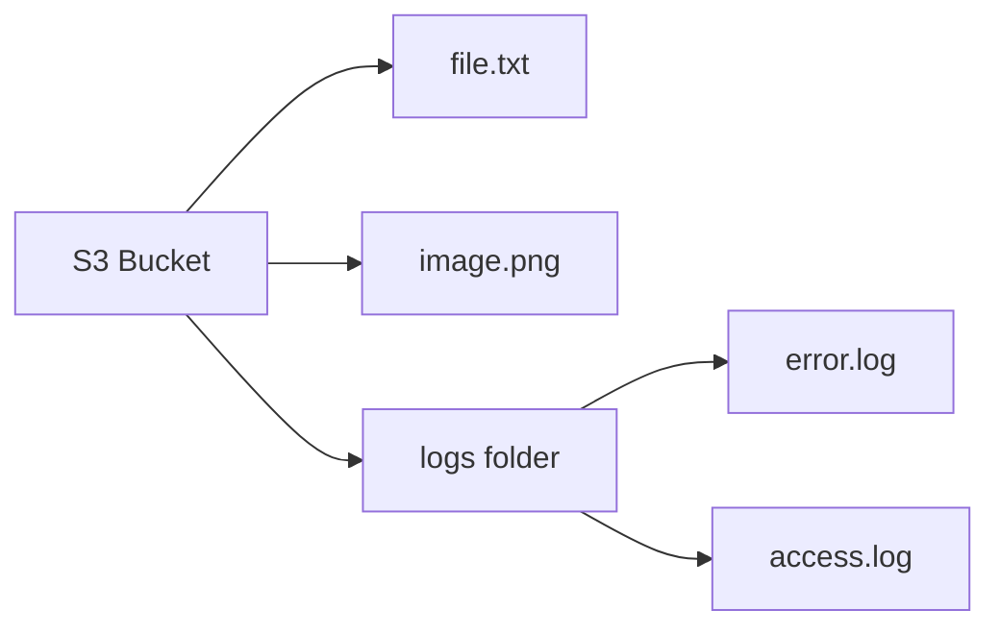
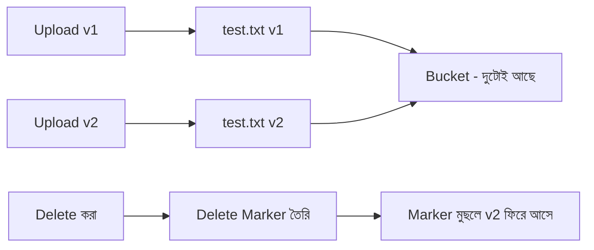
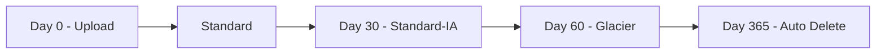
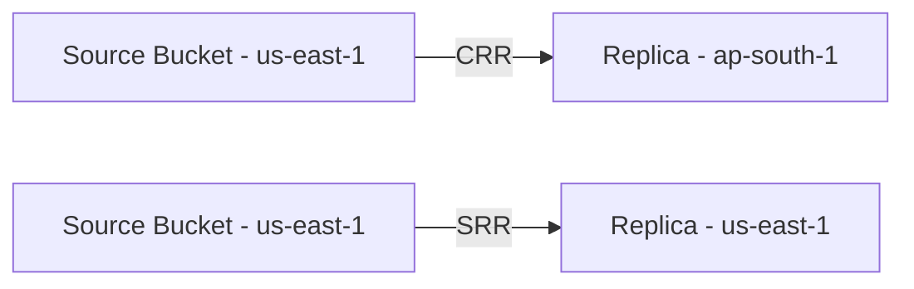
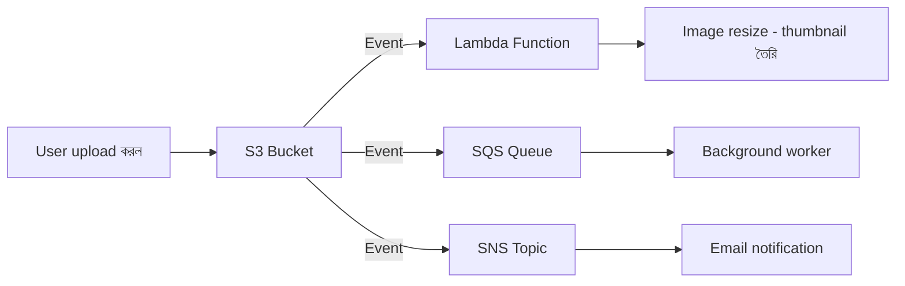
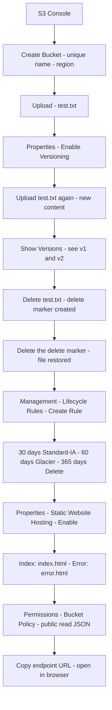

# Day 8: Amazon S3 — Object Storage, Versioning, Lifecycle ও Static Website

### Floci দিয়ে হাতে-কলমে শেখো (Git Bash)

> সব কমান্ড **Git Bash**-এ রান করতে হবে।
> কমান্ড রান করার আগে **Docker Desktop** অবশ্যই চালু থাকতে হবে।

📌 **যোগাযোগ / সোশ্যাল মিডিয়া:**
[LinkedIn](https://www.linkedin.com/in/asifaowadud) · [YouTube](https://www.youtube.com/@OOAAOW?sub_confirmation=1) · [Telegram](https://t.me/ooaaow) · [Web Lab](https://oao-devops-lab.vercel.app/) · [Facebook](https://www.facebook.com/OOAAOW/)

---

## পার্ট ১ — তত্ত্ব (Theory)

### S3 কী?

> **Amazon S3 (Simple Storage Service)** হলো AWS-এর object storage service — যেখানে যেকোনো ধরনের file unlimited পরিমাণে store করা যায়।

S3 যেসব কাজে ব্যবহার হয়:

| Use Case               | উদাহরণ                         |
| ---------------------- | ------------------------------ |
| Backup ও restore       | Database dump, server snapshot |
| Static website hosting | HTML, CSS, JS serve করা        |
| Application logs       | Access log, error log archive  |
| Big data source        | Analytics pipeline-এর raw data |
| Media storage          | Image, video, audio file       |

**মূল বৈশিষ্ট্য:**

| বৈশিষ্ট্য     | বিবরণ                                                                   |
| ------------- | ----------------------------------------------------------------------- |
| Durability    | 99.999999999% (11 nine's) — ১ কোটি file রাখলে ১টাও হারানোর সম্ভাবনা নেই |
| Scalability   | Storage limit নেই — একটু থেকে পেটাবাইট                                  |
| Global access | যেকোনো জায়গা থেকে HTTP/HTTPS দিয়ে access                              |
| Security      | Encryption, IAM policy, bucket policy, ACL                              |
| Cost          | Pay-as-you-go — শুধু যতটা ব্যবহার করো                                   |

---

### S3-এর তিনটি মূল ধারণা

| ধারণা      | মানে                                    | উদাহরণ                  |
| ---------- | --------------------------------------- | ----------------------- |
| **Bucket** | File রাখার container — top-level folder | `my-devops-bucket`      |
| **Object** | Bucket-এর ভেতরের file                   | `test.txt`, `image.png` |
| **Key**    | Object-এর নাম বা path                   | `logs/2026/error.log`   |

**S3 URL format:**

```
s3://bucket-name/key
https://bucket-name.s3.amazonaws.com/key
```

উদাহরণ: `s3://my-devops-bucket/logs/error.log`



---

### Bucket তৈরির নিয়ম

- নাম globally unique হতে হবে — পুরো AWS-এ একই নাম আর কেউ ব্যবহার করতে পারবে না
- শুধু lowercase, number, হাইফেন — capital letter বা underscore নিষিদ্ধ
- ৩ থেকে ৬৩ character
- Region select করতে হবে — bucket সেই region-এ থাকবে

---

### S3 Storage Classes

S3-এ data কতটা frequently access করবে তার উপর নির্ভর করে আলাদা storage class আছে — সস্তার দিকে যেতে হলে আগে থেকে ঠিক করে রাখতে হবে:

| Storage Class               | কখন ব্যবহার করবে            | Retrieval     | Cost          |
| --------------------------- | --------------------------- | ------------- | ------------- |
| **S3 Standard**             | প্রতিদিন access হয়         | Milliseconds  | বেশি          |
| **S3 Intelligent-Tiering**  | Access pattern অজানা        | Milliseconds  | মাঝারি        |
| **S3 Standard-IA**          | মাসে একবার access           | Milliseconds  | কম            |
| **S3 One Zone-IA**          | Infrequent, একটি AZ         | Milliseconds  | আরও কম        |
| **S3 Glacier Instant**      | Archive, দ্রুত দরকার        | Milliseconds  | সস্তা         |
| **S3 Glacier Flexible**     | Archive, কয়েক ঘণ্টায় চলবে | Minutes-Hours | আরও সস্তা     |
| **S3 Glacier Deep Archive** | ৭+ বছর archive              | Hours         | সবচেয়ে সস্তা |

---

### Versioning কী এবং কেন দরকার?

> **Versioning** মানে একই key (নাম)-এর file বারবার upload করলে সব version সংরক্ষিত থাকে।



**Versioning-এ delete কীভাবে কাজ করে:**

- File delete করলে সরাসরি মোছে না — একটি **Delete Marker** তৈরি হয়
- পুরনো সব version bucket-এ থাকে
- Delete Marker মুছলে file restore হয়ে যায়

**কখন লাগে:**

- কেউ ভুল করে important file delete করেছে → restore করো
- Code deploy করার পর bug পেলে → আগের version-এ ফিরে যাও
- Compliance — file-এর ইতিহাস রাখা বাধ্যতামূলক

---

### Lifecycle Policy কী?

> **Lifecycle Policy** হলো automated rule — নির্দিষ্ট সময় পর object নিজে নিজে cheaper storage class-এ যাবে বা delete হবে।



**কেন দরকার:** Manually storage class change করা ভুলে যাওয়া সহজ। Lifecycle দিলে AWS নিজে নিজে cost optimize করে।

---

### S3 Security

| Security Layer            | কী করে                              |
| ------------------------- | ----------------------------------- |
| **Bucket Policy**         | JSON rule — কে কী করতে পারবে        |
| **IAM Policy**            | User বা role-level permission       |
| **Block Public Access**   | সব public access বন্ধ (default: on) |
| **Encryption at rest**    | SSE-S3, SSE-KMS, SSE-C              |
| **Encryption in transit** | HTTPS — data transfer-এ TLS         |
| **Access Logging**        | কে কখন কী করেছে তার log             |

**Encryption options:**

- **SSE-S3:** AWS নিজেই key manage করে — সবচেয়ে সহজ
- **SSE-KMS:** AWS KMS দিয়ে key manage — audit trail পাওয়া যায়
- **SSE-C:** তুমি নিজে key দাও — সর্বোচ্চ control

---

### Advanced Features (Reference)

| Feature                  | কী করে                                             |
| ------------------------ | -------------------------------------------------- |
| **S3 Replication (CRR)** | অন্য region-এ automatic copy — disaster recovery   |
| **S3 Replication (SRR)** | একই region-এ copy — low-latency access             |
| **Event Notifications**  | File upload হলে Lambda trigger বা SQS message      |
| **Multipart Upload**     | বড় file (100MB+) parts-এ upload — resume করা যায় |
| **S3 Batch Operations**  | লাখো object-এ একসাথে operation (tag, copy, delete) |

---

## পার্ট ২ — Floci দিয়ে হাতে-কলমে (CLI)

> **Floci-তে S3 support:**
>
> | কমান্ড                             | Floci                                               |
> | ---------------------------------- | --------------------------------------------------- |
> | `aws s3 mb` — bucket তৈরি          | ✅                                                  |
> | `aws s3 cp` — file upload/download | ✅                                                  |
> | `aws s3 ls` — list                 | ✅                                                  |
> | `aws s3 rm` — delete               | ✅                                                  |
> | Versioning enable/describe         | ✅                                                  |
> | Delete marker তৈরি ও restore       | ✅                                                  |
> | Lifecycle configuration            | ✅ API accept করে (time-based rules execute হয় না) |
> | Bucket Policy                      | ✅ API accept করে                                   |
> | Static website HTTP serve          | ❌ Real HTTP server নেই                             |
> | S3 Replication                     | ❌                                                  |
> | Event Notifications                | ❌                                                  |

---

### ধাপ ০ — Floci চালু করো

**কেন করছি?** Floci না চালালে সব command fail করবে।

```bash
floci start --persist ./floci-data
eval $(floci env)
echo $AWS_ENDPOINT_URL
```

**প্রত্যাশিত output:**

```
http://localhost:4566
```

---

### ধাপ ১ — Bucket তৈরি করো

**কেন করছি?** সব S3 object একটি bucket-এর ভেতরে রাখতে হয় — প্রথমে bucket তৈরি না করলে file upload করা যাবে না।

```bash
aws s3 mb s3://devops-demo-bucket
```

**প্রত্যাশিত output:**

```
make_bucket: devops-demo-bucket
```

**যাচাই করো:**

```bash
aws s3 ls
```

**প্রত্যাশিত output:**

```
2026-07-01 00:00:00 devops-demo-bucket
```

---

### ধাপ ২ — File তৈরি ও Upload করো

**কেন করছি?** Bucket-এ data রাখার অভিজ্ঞতা নিচ্ছি — S3-এর মূল কাজ হলো file store করা।

```bash
echo "Hello from S3 - version 1" > test.txt
aws s3 cp test.txt s3://devops-demo-bucket/
```

**প্রত্যাশিত output:**

```
upload: ./test.txt to s3://devops-demo-bucket/test.txt
```

**Bucket-এর ভেতরে দেখো:**

```bash
aws s3 ls s3://devops-demo-bucket/
```

**প্রত্যাশিত output:**

```
2026-07-01 00:00:00         26 test.txt
```

---

### ধাপ ৩ — File Download করো

**কেন করছি?** Upload সঠিকভাবে হয়েছে কিনা verify করছি এবং download workflow শিখছি।

```bash
aws s3 cp s3://devops-demo-bucket/test.txt downloaded.txt
cat downloaded.txt
```

**প্রত্যাশিত output:**

```
Hello from S3 - version 1
```

---

### ধাপ ৪ — Versioning Enable করো

**কেন করছি?** Versioning চালু না থাকলে same file আবার upload করলে আগেরটা চলে যাবে। চালু থাকলে সব version সংরক্ষিত থাকে।

```bash
aws s3api put-bucket-versioning \
  --bucket devops-demo-bucket \
  --versioning-configuration Status=Enabled
```

**প্রত্যাশিত output:**

```
(কোনো output আসবে না — এটা স্বাভাবিক, মানে সফল হয়েছে)
```

**যাচাই করো:**

```bash
aws s3api get-bucket-versioning --bucket devops-demo-bucket
```

**প্রত্যাশিত output:**

```json
{
  "Status": "Enabled"
}
```

---

### ধাপ ৫ — Same File আবার Upload করো (নতুন Version)

**কেন করছি?** Versioning কীভাবে কাজ করে সেটা দেখছি — একই নামের file upload করলে নতুন version তৈরি হবে, আগেরটা থাকবে।

```bash
echo "Hello from S3 - version 2 (modified)" > test.txt
aws s3 cp test.txt s3://devops-demo-bucket/
```

**প্রত্যাশিত output:**

```
upload: ./test.txt to s3://devops-demo-bucket/test.txt
```

---

### ধাপ ৬ — সব Version দেখো

**কেন করছি?** Verify করছি যে দুটো version bucket-এ আছে।

```bash
aws s3api list-object-versions \
  --bucket devops-demo-bucket \
  --prefix test.txt
```

**প্রত্যাশিত output:**

```json
{
  "Versions": [
    {
      "Key": "test.txt",
      "VersionId": "version-id-2",
      "IsLatest": true,
      "LastModified": "2026-07-01T00:01:00+00:00",
      "Size": 38
    },
    {
      "Key": "test.txt",
      "VersionId": "version-id-1",
      "IsLatest": false,
      "LastModified": "2026-07-01T00:00:00+00:00",
      "Size": 26
    }
  ]
}
```

---

### ধাপ ৭ — File Delete করো (Delete Marker দেখো)

**কেন করছি?** Versioning চালু থাকলে delete কীভাবে আলাদা আচরণ করে সেটা দেখছি — file মোছে না, Delete Marker তৈরি হয়।

```bash
aws s3 rm s3://devops-demo-bucket/test.txt
```

**প্রত্যাশিত output:**

```
delete: s3://devops-demo-bucket/test.txt
```

**Delete Marker confirm করো:**

```bash
aws s3api list-object-versions \
  --bucket devops-demo-bucket \
  --prefix test.txt
```

**প্রত্যাশিত output:**

```json
{
  "DeleteMarkers": [
    {
      "Key": "test.txt",
      "VersionId": "delete-marker-id",
      "IsLatest": true
    }
  ],
  "Versions": [
    { "Key": "test.txt", "VersionId": "version-id-2", "IsLatest": false },
    { "Key": "test.txt", "VersionId": "version-id-1", "IsLatest": false }
  ]
}
```

> `IsLatest: true` যেটায় সেটাই Delete Marker — file দেখা যাচ্ছে না, কিন্তু versions এখনও আছে।

---

### ধাপ ৮ — File Restore করো

**কেন করছি?** Delete Marker সরিয়ে দিলে latest version আবার visible হয় — এটাই accidental delete recovery।

আগের ধাপের output থেকে Delete Marker-এর আসল `VersionId` নাও:

```bash
aws s3api list-object-versions \
  --bucket devops-demo-bucket \
  --prefix test.txt \
  --query 'DeleteMarkers[0].VersionId' \
  --output text
```

**প্রত্যাশিত output:**

```
bfc91905-505e-4f38-9c43-612042a4cb8c   ← তোমার actual ID ভিন্ন হবে
```

সেই ID দিয়ে Delete Marker মুছো:

```bash
MARKER_ID=$(aws s3api list-object-versions \
  --bucket devops-demo-bucket \
  --prefix test.txt \
  --query 'DeleteMarkers[0].VersionId' \
  --output text)

aws s3api delete-object \
  --bucket devops-demo-bucket \
  --key test.txt \
  --version-id $MARKER_ID
```

**প্রত্যাশিত output:**

```json
{
  "DeleteMarker": true,
  "VersionId": "bfc91905-505e-4f38-9c43-612042a4cb8c"
}
```

**File ফিরে এসেছে কিনা যাচাই করো:**

```bash
aws s3 ls s3://devops-demo-bucket/
```

**প্রত্যাশিত output:**

```
2026-07-01 00:01:00         38 test.txt
```

---

### ধাপ ৯ — Lifecycle Policy তৈরি করো

**কেন করছি?** Time-based rule দিয়ে পুরনো data automatically সস্তা storage class-এ move করছি — manual কাজ ছাড়াই cost কমবে।

Lifecycle rule-এর JSON file তৈরি করো:

```bash
cat > lifecycle.json << 'EOF'
{
    "Rules": [
        {
            "ID": "move-to-glacier",
            "Status": "Enabled",
            "Filter": {
                "Prefix": ""
            },
            "Transitions": [
                {
                    "Days": 30,
                    "StorageClass": "STANDARD_IA"
                },
                {
                    "Days": 60,
                    "StorageClass": "GLACIER"
                }
            ],
            "Expiration": {
                "Days": 365
            }
        }
    ]
}
EOF
```

```bash
aws s3api put-bucket-lifecycle-configuration \
  --bucket devops-demo-bucket \
  --lifecycle-configuration file://lifecycle.json
```

**প্রত্যাশিত output:**

```
(কোনো output আসবে না — এটা স্বাভাবিক, মানে সফল হয়েছে)
```

**যাচাই করো:**

```bash
aws s3api get-bucket-lifecycle-configuration \
  --bucket devops-demo-bucket
```

**প্রত্যাশিত output:**

```json
{
  "Rules": [
    {
      "ID": "move-to-glacier",
      "Status": "Enabled",
      "Transitions": [
        { "Days": 30, "StorageClass": "STANDARD_IA" },
        { "Days": 60, "StorageClass": "GLACIER" }
      ],
      "Expiration": { "Days": 365 }
    }
  ]
}
```

> ⚠️ **Floci note:** Lifecycle rule তৈরি হয়েছে। কিন্তু Floci time-based rule execute করে না — 30/60 দিন পর automatically move হবে না। Real AWS-এ এই rule কাজ করবে।

---

### ধাপ ১০ — Bucket Policy সেট করো

#### Bucket Policy কী?

Bucket Policy হলো একটি JSON document যেটা দিয়ে তুমি বলে দাও — **কে, কী action করতে পারবে, কোন resource-এ।**

ধরো তোমার একটা S3 bucket আছে। সেই bucket-এ:

- তোমার একটা app সব কিছু upload করতে পারবে
- তোমার একজন colleague শুধু file পড়তে পারবে, মুছতে পারবে না
- বাইরের কেউ কিছুই করতে পারবে না

এই সবটাই Bucket Policy দিয়ে define করা হয়।

#### Policy JSON-এর প্রতিটি field মানে কী?

```json
{
    "Version": "2012-10-17",      ← সবসময় এটাই — policy language-এর version
    "Statement": [                ← একটি বা একাধিক rule-এর list
        {
            "Sid": "MyRuleName",  ← rule-এর একটা label (যেকোনো নাম দাও)
            "Effect": "Allow",    ← "Allow" বা "Deny" — permission দেবে না নেবে
            "Principal": "*",     ← কার জন্য — "*" মানে সবাই, নির্দিষ্ট ARN দিলে শুধু সে
            "Action": "s3:GetObject",  ← কী করতে পারবে — S3 operation
            "Resource": "arn:aws:s3:::bucket-name/*"  ← কোন bucket বা object-এ
        }
    ]
}
```

#### কার জন্য Bucket Policy লিখবে?

| Principal                                       | উদাহরণ             | কখন                      |
| ----------------------------------------------- | ------------------ | ------------------------ |
| `"*"`                                           | সবাই (internet সহ) | Public static website    |
| `{"AWS": "arn:aws:iam::123456789012:user/dev"}` | নির্দিষ্ট IAM user | Specific teammate access |
| `{"AWS": "arn:aws:iam::123456789012:root"}`     | পুরো AWS account   | Cross-account access     |
| `{"Service": "lambda.amazonaws.com"}`           | AWS Lambda service | Lambda bucket read করবে  |

#### উদাহরণ ১ — নির্দিষ্ট user-কে read-only access দাও

**কেন করছি?** Team member শুধু file দেখতে পারবে, upload বা delete করতে পারবে না — এটাই least privilege principle।

```bash
cat > bucket-policy.json << 'EOF'
{
    "Version": "2012-10-17",
    "Statement": [
        {
            "Sid": "AllowReadOnly",
            "Effect": "Allow",
            "Principal": {
                "AWS": "arn:aws:iam::000000000000:root"
            },
            "Action": [
                "s3:GetObject",
                "s3:ListBucket"
            ],
            "Resource": [
                "arn:aws:s3:::devops-demo-bucket",
                "arn:aws:s3:::devops-demo-bucket/*"
            ]
        }
    ]
}
EOF

aws s3api put-bucket-policy \
  --bucket devops-demo-bucket \
  --policy file://bucket-policy.json
```

**প্রত্যাশিত output:**

```
(কোনো output আসবে না — এটা স্বাভাবিক, মানে সফল হয়েছে)
```

**যাচাই করো — Policy সেট হয়েছে কিনা:**

```bash
aws s3api get-bucket-policy \
  --bucket devops-demo-bucket \
  --output text
```

**প্রত্যাশিত output:**

```json
{
  "Version": "2012-10-17",
  "Statement": [
    {
      "Sid": "AllowReadOnly",
      "Effect": "Allow",
      "Principal": { "AWS": "arn:aws:iam::000000000000:root" },
      "Action": ["s3:GetObject", "s3:ListBucket"],
      "Resource": [
        "arn:aws:s3:::devops-demo-bucket",
        "arn:aws:s3:::devops-demo-bucket/*"
      ]
    }
  ]
}
```

> **Floci note:** Policy সেট হয় এবং `get-bucket-policy`-তে দেখা যায়। কিন্তু Floci policy enforce করে না — "Deny" দিলেও Floci-তে block হবে না। Real AWS-এ এটা কাজ করে।

---

### ধাপ ১১ — Cleanup

**কেন করছি?** Versioning চালু থাকলে `aws s3 rb --force` কাজ করবে না — আগে সব versions মুছতে হবে।

```bash
# সব versions ও delete markers মুছো
aws s3api delete-objects \
  --bucket devops-demo-bucket \
  --delete "$(aws s3api list-object-versions \
    --bucket devops-demo-bucket \
    --query '{Objects: Versions[].{Key:Key,VersionId:VersionId}}' \
    --output json)"

# Bucket মুছো
aws s3 rb s3://devops-demo-bucket --force
```

**প্রত্যাশিত output:**

```
remove_bucket: devops-demo-bucket
```

---

## পার্ট ৩ — Real AWS-এ Static Website Hosting

> ⚠️ **Floci-তে এই section কাজ করে না।** Floci real HTTP server serve করে না — static website-এর URL খুলবে না।
> **কখন করবে:** Real AWS account-এ একটি S3 bucket তৈরি করার পর এখানে এসো।

---

### ধাপ ১ — HTML File তৈরি করো

**কেন করছি?** S3 যে files serve করবে সেগুলো আগে local-এ তৈরি করতে হবে।

```bash
cat > index.html << 'EOF'
<!DOCTYPE html>
<html>
<head><title>DevOps Steps</title></head>
<body>
  <h1>Hello from S3 Static Website</h1>
  <p>Hosted on AWS S3</p>
</body>
</html>
EOF

cat > error.html << 'EOF'
<!DOCTYPE html>
<html>
<body><h1>Error: Page not found</h1></body>
</html>
EOF
```

---

### ধাপ ২ — Static Website-এর জন্য Bucket তৈরি করো

**কেন করছি?** Static website-এর bucket আলাদা — public access allow করতে হবে, নইলে browser file দেখতে পাবে না।

```bash
aws s3 mb s3://ooaaow-static-site --region us-east-1
```

**Block Public Access বন্ধ করো (Real AWS-এ):**

```bash
aws s3api put-public-access-block \
  --bucket ooaaow-static-site \
  --public-access-block-configuration '{"BlockPublicAcls":false,"IgnorePublicAcls":false,"BlockPublicPolicy":false,"RestrictPublicBuckets":false}'
```

---

### ধাপ ৩ — Files Upload করো

```bash
aws s3 cp index.html s3://ooaaow-static-site/
aws s3 cp error.html s3://ooaaow-static-site/
```

---

### ধাপ ৪ — Static Website Hosting Enable করো

**কেন করছি?** Default-এ S3 bucket HTTP serve করে না — এই config চালু করলে S3 একটি website endpoint তৈরি করে।

```bash
aws s3api put-bucket-website \
  --bucket ooaaow-static-site \
  --website-configuration '{
    "IndexDocument": {"Suffix": "index.html"},
    "ErrorDocument": {"Key": "error.html"}
  }'
```

---

### ধাপ ৫ — Public Read Bucket Policy সেট করো

**কেন করছি?** এই policy ছাড়া browser bucket-এর file পড়তে পারবে না — website খুলবে না।

```bash
cat > website-policy.json << 'EOF'
{
    "Version": "2012-10-17",
    "Statement": [
        {
            "Sid": "PublicRead",
            "Effect": "Allow",
            "Principal": "*",
            "Action": "s3:GetObject",
            "Resource": "arn:aws:s3:::ooaaow-static-site/*"
        }
    ]
}
EOF

aws s3api put-bucket-policy \
  --bucket ooaaow-static-site \
  --policy file://website-policy.json
```

---

### ধাপ ৬ — Website যাচাই করো

**Floci-তে (File content verify করো):**

Floci-তে website URL browser-এ খোলা যাবে না — কিন্তু file সঠিকভাবে upload হয়েছে কিনা এবং content ঠিক আছে কিনা এভাবে দেখা যাবে:

```bash
# পদ্ধতি ১ — curl দিয়ে সরাসরি HTTP request
curl http://localhost:4566/ooaaow-static-site/index.html
```

**প্রত্যাশিত output:**

```html
<!DOCTYPE html>
<html>
  <head>
    <title>DevOps Steps</title>
  </head>
  <body>
    <h1>Hello from S3 Static Website</h1>
    <p>Hosted on AWS S3</p>
  </body>
</html>
```

```bash
# পদ্ধতি ২ — aws s3 cp দিয়ে content দেখো
aws s3 cp s3://ooaaow-static-site/index.html -
```

> `-` মানে file local-এ save না করে সরাসরি terminal-এ print করো।

**Real AWS-এ:**

```bash
echo "http://ooaaow-static-site.s3-website-us-east-1.amazonaws.com"
```

Browser-এ এই URL খোলো → **"Hello from S3 Static Website"** দেখা যাবে ✅

---

## পার্ট ৪ — Advanced Features (Reference)

> এই section-এর features Floci-তে কাজ করে না। Real AWS-এ কখন এবং কেন ব্যবহার করবে সেটা বোঝার জন্য পড়ো।

---

### S3 Replication — স্বয়ংক্রিয় Copy

#### কী এটা?

S3 Replication মানে একটি bucket-এ কোনো file upload হলে AWS সেটা **automatically অন্য একটি bucket-এ copy** করে দেয় — তোমাকে কিছু করতে হয় না।

#### কেন দরকার?

| সমস্যা                                    | Replication কীভাবে সমাধান করে               |
| ----------------------------------------- | ------------------------------------------- |
| Mumbai region down হয়ে গেছে              | Singapore-এ copy আছে — user সেখান থেকে পাবে |
| Compliance — data ২টি দেশে রাখতে হবে      | CRR দিয়ে দ্বিতীয় region-এ রাখো            |
| Dev team US-এ, Prod Asia-তে — upload slow | Asia region-এ replica রাখলে দ্রুত access    |

#### দুটো ধরন:



| Type    | পুরো নাম                 | কখন ব্যবহার                                   |
| ------- | ------------------------ | --------------------------------------------- |
| **CRR** | Cross-Region Replication | Disaster recovery, compliance, global latency |
| **SRR** | Same-Region Replication  | Log aggregation, test-to-prod sync, backup    |

#### গুরুত্বপূর্ণ শর্ত:

- Source ও destination দুটো bucket-এই **Versioning চালু থাকতে হবে**
- Replication চালু করার আগের পুরনো files copy হয় না — শুধু নতুন files

```bash
# Real AWS-এ — source bucket-এ replication rule দাও
aws s3api put-bucket-replication \
  --bucket source-bucket \
  --replication-configuration file://replication-config.json
```

---

### S3 Event Notifications — File Upload হলে Action

#### কী এটা?

S3 bucket-এ কোনো নির্দিষ্ট ঘটনা ঘটলে (যেমন file upload, delete) AWS **automatically অন্য service-কে জানায়** — তুমি সেই notification দিয়ে কোনো action trigger করতে পারো।

#### কেন দরকার?

**উদাহরণ:** User একটি ছবি upload করল → S3 Lambda-কে notify করল → Lambda ছবিটা resize করল → Thumbnail S3-এ save করল।

এই পুরো flow manual monitoring ছাড়াই চলে।



#### কোন event trigger করে?

| Event                | কখন হয়                  |
| -------------------- | ------------------------ |
| `s3:ObjectCreated:*` | File upload হলে          |
| `s3:ObjectRemoved:*` | File delete হলে          |
| `s3:ObjectRestore:*` | Glacier থেকে restore হলে |

```bash
# Real AWS-এ
aws s3api put-bucket-notification-configuration \
  --bucket devops-demo-bucket \
  --notification-configuration file://notification.json
```

---

### Multipart Upload — বড় File ভেঙে Upload

#### কী এটা?

সাধারণ upload-এ পুরো file একসাথে পাঠানো হয়। **Multipart Upload** মানে বড় file-কে ছোট ছোট part-এ ভেঙে upload করা — প্রতিটা part আলাদাভাবে পাঠানো হয়, শেষে AWS জোড়া দেয়।

#### কেন দরকার?

| সমস্যা (Normal Upload)                                             | সমাধান (Multipart)                            |
| ------------------------------------------------------------------ | --------------------------------------------- |
| 2GB file upload করতে গিয়ে মাঝপথে network গেল → শুরু থেকে করতে হবে | যেখানে বন্ধ হয়েছে সেখান থেকে resume করা যায় |
| একটি connection-এ সব data — ধীরে                                   | একাধিক part parallel-এ যায় — দ্রুত           |
| 5GB-এর বেশি file single PUT-এ upload হয় না                        | Multipart-এ 5TB পর্যন্ত                       |

#### কখন ব্যবহার করবে:

- **100MB-এর বেশি** file → Multipart recommended
- **5GB-এর বেশি** → Multipart বাধ্যতামূলক (single PUT-এ limit)

```bash
# aws s3 cp নিজেই বড় file-এ automatically multipart করে
aws s3 cp large-file.zip s3://devops-demo-bucket/ \
  --multipart-threshold 64MB \
  --multipart-chunksize 16MB
```

> `--multipart-threshold 64MB` মানে ৬৪MB-এর বেশি file হলে multipart শুরু হবে।
> `--multipart-chunksize 16MB` মানে প্রতিটা part ১৬MB করে।

---

### S3 Batch Operations — লাখো Object-এ একসাথে কাজ

#### কী এটা?

ধরো তোমার bucket-এ ১০ লক্ষ file আছে। সবগুলোতে একটা tag যোগ করতে হবে। একটা একটা করে করলে কতদিন লাগবে? **S3 Batch Operations** দিয়ে একটি job তৈরি করলে AWS নিজেই সব objects-এ সেই operation চালিয়ে দেয়।

#### কোন কাজে লাগে?

| Operation       | Real-world উদাহরণ                             |
| --------------- | --------------------------------------------- |
| Object tagging  | সব পুরনো log-এ `status=archive` tag দাও       |
| Object copy     | এক bucket থেকে আরেক bucket-এ সব move করো      |
| ACL পরিবর্তন    | সব public object private করে দাও              |
| Glacier restore | ৫০,০০০ archived file একসাথে restore করো       |
| Lambda invoke   | প্রতিটি object-এ একটা custom processing চালাও |

#### কীভাবে কাজ করে:

১. একটি **manifest file** তৈরি করো (কোন bucket, কোন objects)
২. Job তৈরি করো — operation বলে দাও
৩. AWS নিজে সব objects process করে — তোমাকে কিছু করতে হয় না
৪. Job শেষে completion report পাও

```bash
# Real AWS-এ
aws s3control create-job \
  --account-id 123456789012 \
  --operation '{"S3PutObjectTagging": {"TagSet": [{"Key": "status", "Value": "archive"}]}}' \
  --manifest file://manifest.json \
  --priority 10 \
  --role-arn arn:aws:iam::123456789012:role/S3BatchRole
```

---

## Monitoring ও Troubleshooting

### Access Logging — কে কখন কী করল?

#### কী এটা?

S3 Access Logging চালু করলে bucket-এ প্রতিটি request-এর record একটি **আলাদা log bucket-এ** জমা হয় — কে কোন file download করেছে, কখন, কোন IP থেকে সব।

#### কেন দরকার?

| প্রশ্ন                                | Access Log থেকে উত্তর          |
| ------------------------------------- | ------------------------------ |
| "কে আমার file download করেছে?"        | Requester IP ও user agent দেখো |
| "কখন থেকে error আসছে?"                | Timestamp দেখো                 |
| "কোন file সবচেয়ে বেশি access হচ্ছে?" | Key দিয়ে count করো            |
| "কেউ unauthorized access নিয়েছে?"    | Error code 403 খোঁজো           |

#### কীভাবে সেট করবে:

**গুরুত্বপূর্ণ:** Log যেখানে লেখা হবে সেটা আলাদা একটি bucket হতে হবে — নিজের bucket-এই log লিখলে সেই log-ও আবার log তৈরি করবে (অনন্ত loop)।

```bash
# আগে log রাখার জন্য আলাদা bucket তৈরি করো
aws s3 mb s3://my-access-log-bucket

# এরপর logging চালু করো
aws s3api put-bucket-logging \
  --bucket devops-demo-bucket \
  --bucket-logging-status '{
    "LoggingEnabled": {
      "TargetBucket": "my-access-log-bucket",
      "TargetPrefix": "s3-logs/"
    }
  }'
```

**Log file কেমন দেখতে:**

```
79a59df900b949e55d96a1e698fbacedfd6e09d98405f87fb73ad13890a17fb mybucket [06/Feb/2014:00:00:38 +0000] 192.0.2.3 arn:aws:iam::111122223333:user/johndoe 3E57427F3EXAMPLE REST.GET.VERSIONING - "GET /mybucket?versioning HTTP/1.1" 200 - 113 - 7 - "-" "S3Console/0.4" -
```

### সাধারণ Error এবং সমাধান

| Error                   | কারণ                      | সমাধান                                              |
| ----------------------- | ------------------------- | --------------------------------------------------- |
| `AccessDenied`          | Permission নেই            | Bucket policy বা IAM policy check করো               |
| `NoSuchBucket`          | Bucket পাওয়া যাচ্ছে না   | Region ঠিক আছে কিনা দেখো                            |
| `BucketAlreadyExists`   | নাম অন্য কেউ ব্যবহার করছে | Unique নাম ব্যবহার করো                              |
| Website খুলছে না        | Block public access চালু  | `put-public-access-block` দিয়ে বন্ধ করো            |
| File ভুলে delete হয়েছে | Versioning চালু ছিল না    | Versioning চালু করো, delete marker মুছে restore করো |

### Deleted Object Recover করো

```bash
# Delete markers দেখো
aws s3api list-object-versions \
  --bucket devops-demo-bucket \
  --query 'DeleteMarkers[*].[Key,VersionId]' \
  --output table

# Delete marker মুছো
aws s3api delete-object \
  --bucket devops-demo-bucket \
  --key filename.txt \
  --version-id DELETE_MARKER_VERSION_ID
```

---

## Real DevOps Use Cases

| Use Case        | S3 কীভাবে ব্যবহার হয়                           |
| --------------- | ----------------------------------------------- |
| Terraform state | `terraform.tfstate` S3-এ store, DynamoDB-এ lock |
| CI/CD artifact  | Build করা binary S3-এ upload, deploy-এ download |
| Log archive     | Application log S3-এ → Athena দিয়ে query       |
| Database backup | `pg_dump` বা `mysqldump` S3-এ রোজ রাত-এ         |
| Static website  | Portfolio, documentation, landing page          |

---

## Common Mistakes

| Mistake                            | কী হয়                                        | সমাধান                                     |
| ---------------------------------- | --------------------------------------------- | ------------------------------------------ |
| Versioning ছাড়া production bucket | Accidental delete → সব হারিয়ে যায়           | সবসময় versioning enable করো               |
| Lifecycle ছাড়া log bucket         | Log জমতে থাকে, cost বাড়তে থাকে               | Lifecycle দিয়ে expire করো                 |
| ভুল storage class                  | Frequent data Glacier-এ → retrieval cost বেশি | Access pattern বুঝে storage class বেছো     |
| Public access block না করা         | যেকেউ bucket দেখতে পারে                       | Default: Block all public access চালু রাখো |
| Bucket name-এ uppercase            | Bucket তৈরি হয় না                            | শুধু lowercase ব্যবহার করো                 |

---

## দ্রুত তথ্যসূত্র — S3 কমান্ড চিট শিট

| কমান্ড                                                                                                  | কী করে               |
| ------------------------------------------------------------------------------------------------------- | -------------------- |
| `aws s3 mb s3://bucket-name`                                                                            | Bucket তৈরি          |
| `aws s3 ls`                                                                                             | সব bucket দেখো       |
| `aws s3 ls s3://bucket-name/`                                                                           | Bucket-এর ভেতরে দেখো |
| `aws s3 cp file.txt s3://bucket/`                                                                       | File upload          |
| `aws s3 cp s3://bucket/file.txt .`                                                                      | File download        |
| `aws s3 rm s3://bucket/file.txt`                                                                        | File delete          |
| `aws s3 sync ./folder s3://bucket/`                                                                     | Folder sync          |
| `aws s3 rb s3://bucket-name --force`                                                                    | Bucket মুছো          |
| `aws s3api put-bucket-versioning --bucket name --versioning-configuration Status=Enabled`               | Versioning চালু      |
| `aws s3api list-object-versions --bucket name`                                                          | সব version দেখো      |
| `aws s3api put-bucket-lifecycle-configuration --bucket name --lifecycle-configuration file://rule.json` | Lifecycle rule সেট   |
| `aws s3api put-bucket-policy --bucket name --policy file://policy.json`                                 | Bucket policy সেট    |

---

## Real AWS Console-এ ফ্লো (রেফারেন্স)

**সংক্ষেপে:**
`S3 Console → Create Bucket → Upload File → Properties → Enable Versioning → Upload again → Show Versions → Delete → Delete Marker → Remove Marker → Restored → Management → Lifecycle Rules → Create Rule → Static Website → Properties → Enable → Bucket Policy → Access URL`

<details>
<summary>📊 বিস্তারিত ভিজ্যুয়াল ডায়াগ্রাম দেখতে ক্লিক করো</summary>



</details>

---

## আজকে যা তৈরি করলে

```
Day8-S3-floci/
├── devops-demo-bucket         ← Versioning + Lifecycle + Policy (Floci)
│   ├── test.txt (v1)
│   ├── test.txt (v2)
│   └── lifecycle rule
└── ooaaow-static-site    ← Static Website (Real AWS)
    ├── index.html
    └── error.html
```

| Feature                 | Floci | Real AWS         |
| ----------------------- | ----- | ---------------- |
| Bucket CRUD             | ✅    | ✅               |
| File upload/download    | ✅    | ✅               |
| Versioning ও restore    | ✅    | ✅               |
| Lifecycle configuration | ✅    | ✅ (execute হয়) |
| Bucket Policy           | ✅    | ✅               |
| Static Website HTTP     | ❌    | ✅               |
| Replication             | ❌    | ✅               |
| Event Notifications     | ❌    | ✅               |

---

## বাড়ির কাজ

১. Floci-তে একটি bucket তৈরি করো, versioning চালু করো, same file ৩ বার upload করো এবং সব ৩টি version list করো।
২. Lifecycle rule তৈরি করো যেটা ৭ দিন পর Standard-IA-তে এবং ৩০ দিন পর Glacier-এ নিয়ে যাবে।
৩. Real AWS-এ তোমার নিজের portfolio-র একটি simple HTML page S3-এ host করো এবং URL share করো।

---

## রিসোর্স

- Floci: https://floci.io
- Floci AWS services: https://floci.io/aws
- AWS S3 docs: https://docs.aws.amazon.com/s3/
- S3 Storage Classes: https://aws.amazon.com/s3/storage-classes/
- S3 Static Website: https://docs.aws.amazon.com/AmazonS3/latest/userguide/WebsiteHosting.html
