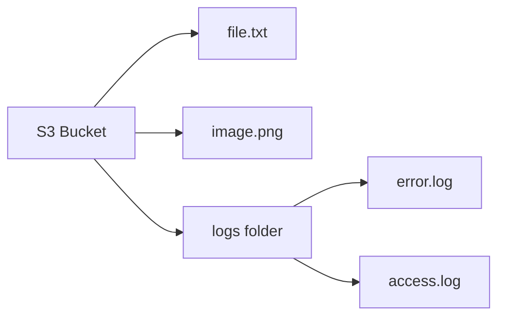
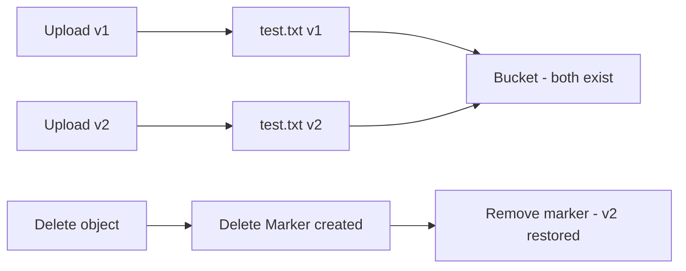
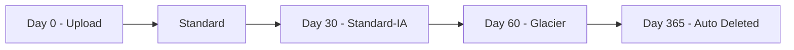
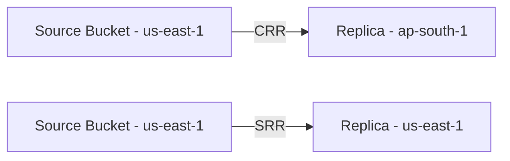
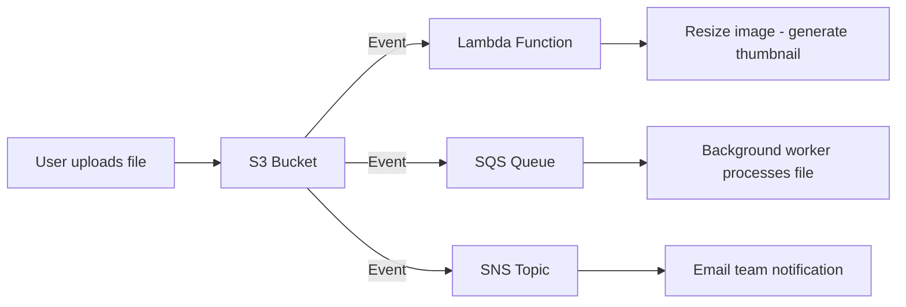
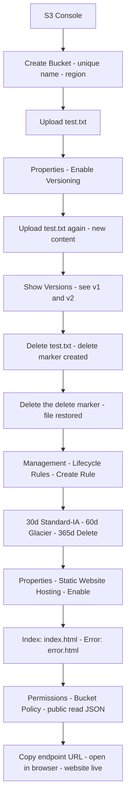

# Day 8: Amazon S3 — Object Storage, Versioning, Lifecycle & Static Website

### Hands-On Learning with Floci (Git Bash)

> All commands must be run in **Git Bash**.
> **Docker Desktop** must be running before executing any commands.

📌 **Connect / Social Media:**
[LinkedIn](https://www.linkedin.com/in/asifaowadud) · [YouTube](https://www.youtube.com/@OOAAOW?sub_confirmation=1) · [Telegram](https://t.me/ooaaow) · [Web Lab](https://oao-devops-lab.vercel.app/) · [Facebook](https://www.facebook.com/OOAAOW/)

---

## Part 1 — Theory

### What is S3?

> **Amazon S3 (Simple Storage Service)** is AWS's object storage service — store any type of file, in any amount, from anywhere.

Common S3 use cases:

| Use Case               | Example                          |
| ---------------------- | -------------------------------- |
| Backup and restore     | Database dumps, server snapshots |
| Static website hosting | Serve HTML, CSS, JS              |
| Application logs       | Archive access and error logs    |
| Big data source        | Raw data for analytics pipelines |
| Media storage          | Images, videos, audio files      |

**Key benefits:**

| Property      | Description                                                     |
| ------------- | --------------------------------------------------------------- |
| Durability    | 99.999999999% (11 nines) — essentially zero chance of data loss |
| Scalability   | No storage limit — bytes to petabytes                           |
| Global access | HTTP/HTTPS access from anywhere                                 |
| Security      | Encryption, IAM policies, bucket policies                       |
| Cost          | Pay only for what you use                                       |

---

### Three Core S3 Concepts

| Concept    | Meaning                                    | Example                 |
| ---------- | ------------------------------------------ | ----------------------- |
| **Bucket** | Container for files — the top-level folder | `my-devops-bucket`      |
| **Object** | A file inside a bucket                     | `test.txt`, `image.png` |
| **Key**    | The object's name or path                  | `logs/2026/error.log`   |

**S3 URL format:**

```
s3://bucket-name/key
https://bucket-name.s3.amazonaws.com/key
```

Example: `s3://my-devops-bucket/logs/error.log`



---

### Bucket Naming Rules

- Must be **globally unique** across all of AWS — no two accounts can share a name
- Lowercase letters, numbers, and hyphens only — no uppercase or underscores
- 3 to 63 characters long
- Must select a region — the bucket lives there

---

### S3 Storage Classes

Choose based on how often you access data — moving to cheaper classes reduces cost:

| Storage Class               | When to Use                    | Retrieval Speed | Cost       |
| --------------------------- | ------------------------------ | --------------- | ---------- |
| **S3 Standard**             | Accessed daily                 | Milliseconds    | Highest    |
| **S3 Intelligent-Tiering**  | Unknown access pattern         | Milliseconds    | Medium     |
| **S3 Standard-IA**          | Accessed monthly               | Milliseconds    | Lower      |
| **S3 One Zone-IA**          | Infrequent, single AZ OK       | Milliseconds    | Even lower |
| **S3 Glacier Instant**      | Archive, fast retrieval needed | Milliseconds    | Cheap      |
| **S3 Glacier Flexible**     | Archive, hours OK              | Minutes–Hours   | Cheaper    |
| **S3 Glacier Deep Archive** | 7+ year retention              | Hours           | Cheapest   |

---

### What is Versioning?

> **Versioning** means every time you upload a file with the same key, all previous versions are preserved.



**How delete works with versioning enabled:**

- Deleting a file does not erase it — a **Delete Marker** is placed on top
- All previous versions remain in the bucket
- Remove the Delete Marker → the file comes back

**When you need it:**

- Someone accidentally deleted an important file → restore it
- Deployed code has a bug → roll back to previous version
- Compliance — regulatory requirement to retain file history

---

### What is a Lifecycle Policy?

> A **Lifecycle Policy** is an automated rule — objects automatically transition to cheaper storage classes or get deleted after a set number of days.



**Why you need it:** It's easy to forget to manually move old data. Lifecycle does it automatically — cost optimization on autopilot.

---

### S3 Security

| Security Layer            | What It Does                             |
| ------------------------- | ---------------------------------------- |
| **Bucket Policy**         | JSON rules — who can do what             |
| **IAM Policy**            | User or role-level permissions           |
| **Block Public Access**   | Blocks all public access (default: on)   |
| **Encryption at rest**    | SSE-S3, SSE-KMS, SSE-C                   |
| **Encryption in transit** | HTTPS — TLS for all transfers            |
| **Access Logging**        | Records every request made to the bucket |

**Encryption options:**

- **SSE-S3:** AWS manages the key — simplest option
- **SSE-KMS:** AWS KMS manages the key — audit trail available
- **SSE-C:** You provide the key — maximum control

---

### Advanced Features (Reference)

| Feature                  | What It Does                                      |
| ------------------------ | ------------------------------------------------- |
| **S3 Replication (CRR)** | Auto-copy to another region — disaster recovery   |
| **S3 Replication (SRR)** | Auto-copy within same region — low-latency access |
| **Event Notifications**  | Trigger Lambda, SQS, or SNS on file upload/delete |
| **Multipart Upload**     | Upload large files (100MB+) in parts — resumable  |
| **S3 Batch Operations**  | Bulk operations on millions of objects at once    |

---

## Part 2 — Hands-On with Floci (CLI)

> **Floci S3 support:**
>
> | Command / Feature             | Floci                                              |
> | ----------------------------- | -------------------------------------------------- |
> | `aws s3 mb` — create bucket   | ✅                                                 |
> | `aws s3 cp` — upload/download | ✅                                                 |
> | `aws s3 ls` — list            | ✅                                                 |
> | `aws s3 rm` — delete          | ✅                                                 |
> | Versioning enable/describe    | ✅                                                 |
> | Delete marker and restore     | ✅                                                 |
> | Lifecycle configuration       | ✅ API accepts it (time-based rules don't execute) |
> | Bucket Policy                 | ✅ API accepts it                                  |
> | Static website HTTP serving   | ❌ No real HTTP server                             |
> | S3 Replication                | ❌                                                 |
> | Event Notifications           | ❌                                                 |

---

### Step 0 — Start Floci

**Why:** Floci must be running or all commands will fail.

```bash
floci start --persist ./floci-data
eval $(floci env)
echo $AWS_ENDPOINT_URL
```

**Expected output:**

```
http://localhost:4566
```

---

### Step 1 — Create a Bucket

**Why:** All S3 objects must live inside a bucket — you can't upload anything without creating one first.

```bash
aws s3 mb s3://devops-demo-bucket
```

**Expected output:**

```
make_bucket: devops-demo-bucket
```

**Verify:**

```bash
aws s3 ls
```

**Expected output:**

```
2026-07-01 00:00:00 devops-demo-bucket
```

---

### Step 2 — Create and Upload a File

**Why:** Experiencing the core S3 workflow — creating an object inside a bucket.

```bash
echo "Hello from S3 - version 1" > test.txt
aws s3 cp test.txt s3://devops-demo-bucket/
```

**Expected output:**

```
upload: ./test.txt to s3://devops-demo-bucket/test.txt
```

**List bucket contents:**

```bash
aws s3 ls s3://devops-demo-bucket/
```

**Expected output:**

```
2026-07-01 00:00:00         26 test.txt
```

---

### Step 3 — Download the File

**Why:** Verifying the upload worked and learning the download workflow.

```bash
aws s3 cp s3://devops-demo-bucket/test.txt downloaded.txt
cat downloaded.txt
```

**Expected output:**

```
Hello from S3 - version 1
```

---

### Step 4 — Enable Versioning

**Why:** Without versioning, uploading the same filename overwrites the previous file permanently. With versioning, every version is kept.

```bash
aws s3api put-bucket-versioning \
  --bucket devops-demo-bucket \
  --versioning-configuration Status=Enabled
```

**Expected output:**

```
(no output — this is normal, it means successful)
```

**Verify:**

```bash
aws s3api get-bucket-versioning --bucket devops-demo-bucket
```

**Expected output:**

```json
{
  "Status": "Enabled"
}
```

---

### Step 5 — Upload the Same File Again (New Version)

**Why:** Seeing versioning in action — same filename, different content, both versions preserved.

```bash
echo "Hello from S3 - version 2 (modified)" > test.txt
aws s3 cp test.txt s3://devops-demo-bucket/
```

**Expected output:**

```
upload: ./test.txt to s3://devops-demo-bucket/test.txt
```

---

### Step 6 — List All Versions

**Why:** Confirming both versions exist in the bucket.

```bash
aws s3api list-object-versions \
  --bucket devops-demo-bucket \
  --prefix test.txt
```

**Expected output:**

```json
{
  "Versions": [
    {
      "Key": "test.txt",
      "VersionId": "version-id-2",
      "IsLatest": true,
      "LastModified": "2026-07-01T00:01:00+00:00",
      "Size": 38
    },
    {
      "Key": "test.txt",
      "VersionId": "version-id-1",
      "IsLatest": false,
      "LastModified": "2026-07-01T00:00:00+00:00",
      "Size": 26
    }
  ]
}
```

---

### Step 7 — Delete the File (See the Delete Marker)

**Why:** With versioning enabled, delete behaves differently — it doesn't erase the file, it creates a Delete Marker on top of it.

```bash
aws s3 rm s3://devops-demo-bucket/test.txt
```

**Expected output:**

```
delete: s3://devops-demo-bucket/test.txt
```

**Confirm the Delete Marker:**

```bash
aws s3api list-object-versions \
  --bucket devops-demo-bucket \
  --prefix test.txt
```

**Expected output:**

```json
{
  "DeleteMarkers": [
    {
      "Key": "test.txt",
      "VersionId": "delete-marker-id",
      "IsLatest": true
    }
  ],
  "Versions": [
    { "Key": "test.txt", "VersionId": "version-id-2", "IsLatest": false },
    { "Key": "test.txt", "VersionId": "version-id-1", "IsLatest": false }
  ]
}
```

> The entry with `"IsLatest": true` is the Delete Marker — the file appears gone, but both versions are still there.

---

### Step 8 — Restore the File

**Why:** Removing the Delete Marker makes the latest version visible again — this is accidental delete recovery.

First, get the actual VersionId of the Delete Marker from the previous step's output:

```bash
aws s3api list-object-versions \
  --bucket devops-demo-bucket \
  --prefix test.txt \
  --query 'DeleteMarkers[0].VersionId' \
  --output text
```

**Expected output:**

```
bfc91905-505e-4f38-9c43-612042a4cb8c   ← your actual ID will differ
```

Use that ID to delete the marker:

```bash
MARKER_ID=$(aws s3api list-object-versions \
  --bucket devops-demo-bucket \
  --prefix test.txt \
  --query 'DeleteMarkers[0].VersionId' \
  --output text)

aws s3api delete-object \
  --bucket devops-demo-bucket \
  --key test.txt \
  --version-id $MARKER_ID
```

**Expected output:**

```json
{
  "DeleteMarker": true,
  "VersionId": "bfc91905-505e-4f38-9c43-612042a4cb8c"
}
```

**Verify the file is back:**

```bash
aws s3 ls s3://devops-demo-bucket/
```

**Expected output:**

```
2026-07-01 00:01:00         38 test.txt
```

---

### Step 9 — Create a Lifecycle Policy

**Why:** Setting up an automated rule so old data moves to cheaper storage classes — cost optimization without manual work.

```bash
cat > lifecycle.json << 'EOF'
{
    "Rules": [
        {
            "ID": "move-to-glacier",
            "Status": "Enabled",
            "Filter": {
                "Prefix": ""
            },
            "Transitions": [
                {
                    "Days": 30,
                    "StorageClass": "STANDARD_IA"
                },
                {
                    "Days": 60,
                    "StorageClass": "GLACIER"
                }
            ],
            "Expiration": {
                "Days": 365
            }
        }
    ]
}
EOF
```

```bash
aws s3api put-bucket-lifecycle-configuration \
  --bucket devops-demo-bucket \
  --lifecycle-configuration file://lifecycle.json
```

**Expected output:**

```
(no output — this is normal, it means successful)
```

**Verify:**

```bash
aws s3api get-bucket-lifecycle-configuration \
  --bucket devops-demo-bucket
```

**Expected output:**

```json
{
  "Rules": [
    {
      "ID": "move-to-glacier",
      "Status": "Enabled",
      "Transitions": [
        { "Days": 30, "StorageClass": "STANDARD_IA" },
        { "Days": 60, "StorageClass": "GLACIER" }
      ],
      "Expiration": { "Days": 365 }
    }
  ]
}
```

> ⚠️ **Floci note:** The lifecycle rule is saved. But Floci does not execute time-based rules — objects won't actually move after 30/60 days. On Real AWS this rule runs automatically.

---

### Step 10 — Set a Bucket Policy

#### What is a Bucket Policy?

A Bucket Policy is a JSON document that defines — **who can do what, on which resource.**

Say you have an S3 bucket. You want:

- Your app to upload anything
- A teammate to only read files, not delete them
- Nobody else to access anything

All of this is defined with a Bucket Policy.

#### What each JSON field means

```json
{
    "Version": "2012-10-17",      ← Always this value — the policy language version
    "Statement": [                ← A list of one or more rules
        {
            "Sid": "MyRuleName",  ← A label for this rule (any name you choose)
            "Effect": "Allow",    ← "Allow" or "Deny"
            "Principal": "*",     ← Who it applies to — "*" means everyone
            "Action": "s3:GetObject",        ← What they can do
            "Resource": "arn:aws:s3:::bucket-name/*"  ← Which bucket or objects
        }
    ]
}
```

#### Who do you write a Bucket Policy for?

| Principal                                       | Example                         | When                    |
| ----------------------------------------------- | ------------------------------- | ----------------------- |
| `"*"`                                           | Everyone including the internet | Public static website   |
| `{"AWS": "arn:aws:iam::123456789012:user/dev"}` | A specific IAM user             | Teammate access         |
| `{"AWS": "arn:aws:iam::123456789012:root"}`     | Entire AWS account              | Cross-account access    |
| `{"Service": "lambda.amazonaws.com"}`           | AWS Lambda service              | Lambda reads the bucket |

#### Example — Give a specific user read-only access

**Why:** A team member can view files but cannot upload or delete — this is the least privilege principle.

```bash
cat > bucket-policy.json << 'EOF'
{
    "Version": "2012-10-17",
    "Statement": [
        {
            "Sid": "AllowReadOnly",
            "Effect": "Allow",
            "Principal": {
                "AWS": "arn:aws:iam::000000000000:root"
            },
            "Action": [
                "s3:GetObject",
                "s3:ListBucket"
            ],
            "Resource": [
                "arn:aws:s3:::devops-demo-bucket",
                "arn:aws:s3:::devops-demo-bucket/*"
            ]
        }
    ]
}
EOF

aws s3api put-bucket-policy \
  --bucket devops-demo-bucket \
  --policy file://bucket-policy.json
```

**Expected output:**

```
(no output — this is normal, it means successful)
```

**Verify — confirm the policy was saved:**

```bash
aws s3api get-bucket-policy \
  --bucket devops-demo-bucket \
  --output text
```

**Expected output:**

```json
{
  "Version": "2012-10-17",
  "Statement": [
    {
      "Sid": "AllowReadOnly",
      "Effect": "Allow",
      "Principal": { "AWS": "arn:aws:iam::000000000000:root" },
      "Action": ["s3:GetObject", "s3:ListBucket"],
      "Resource": [
        "arn:aws:s3:::devops-demo-bucket",
        "arn:aws:s3:::devops-demo-bucket/*"
      ]
    }
  ]
}
```

> **Floci note:** The policy is stored and visible via `get-bucket-policy`. But Floci does not enforce policies — a "Deny" rule won't actually block anything. On Real AWS it works as expected.

---

### Step 11 — Cleanup

**Why:** With versioning enabled, `--force` won't work until all versions are deleted first.

```bash
# Delete all versions and delete markers
aws s3api delete-objects \
  --bucket devops-demo-bucket \
  --delete "$(aws s3api list-object-versions \
    --bucket devops-demo-bucket \
    --query '{Objects: Versions[].{Key:Key,VersionId:VersionId}}' \
    --output json)"

# Remove the bucket
aws s3 rb s3://devops-demo-bucket --force
```

**Expected output:**

```
remove_bucket: devops-demo-bucket
```

---

## Part 3 — Static Website Hosting in Real AWS

> ⚠️ **This section does not work in Floci.** Floci does not run a real HTTP server — the static website URL will not open in a browser.
> **When to start:** After creating a real AWS S3 bucket and having your HTML files ready.

---

### Step 1 — Create the HTML Files

**Why:** S3 will serve these files as a website — create them locally first.

```bash
cat > index.html << 'EOF'
<!DOCTYPE html>
<html>
<head><title>DevOps Steps</title></head>
<body>
  <h1>Hello from S3 Static Website</h1>
  <p>Hosted on AWS S3</p>
</body>
</html>
EOF

cat > error.html << 'EOF'
<!DOCTYPE html>
<html>
<body><h1>Error: Page not found</h1></body>
</html>
EOF
```

---

### Step 2 — Create the Bucket (Public Access Required)

**Why:** A static website bucket must allow public access — otherwise browsers can't read the files.

```bash
aws s3 mb s3://ooaaow-static-site --region us-east-1
```

**Disable Block Public Access (Real AWS):**

```bash
aws s3api put-public-access-block \
  --bucket ooaaow-static-site \
  --public-access-block-configuration '{"BlockPublicAcls":false,"IgnorePublicAcls":false,"BlockPublicPolicy":false,"RestrictPublicBuckets":false}'
```

---

### Step 3 — Upload the Files

```bash
aws s3 cp index.html s3://ooaaow-static-site/
aws s3 cp error.html s3://ooaaow-static-site/
```

---

### Step 4 — Enable Static Website Hosting

**Why:** By default S3 doesn't serve HTTP — enabling this creates a website endpoint URL.

```bash
aws s3api put-bucket-website \
  --bucket ooaaow-static-site \
  --website-configuration '{
    "IndexDocument": {"Suffix": "index.html"},
    "ErrorDocument": {"Key": "error.html"}
  }'
```

---

### Step 5 — Set the Public Read Bucket Policy

**Why:** Without this policy, browsers get an AccessDenied error — the website won't load.

```bash
cat > website-policy.json << 'EOF'
{
    "Version": "2012-10-17",
    "Statement": [
        {
            "Sid": "PublicRead",
            "Effect": "Allow",
            "Principal": "*",
            "Action": "s3:GetObject",
            "Resource": "arn:aws:s3:::ooaaow-static-site/*"
        }
    ]
}
EOF

aws s3api put-bucket-policy \
  --bucket ooaaow-static-site \
  --policy file://website-policy.json
```

---

### Step 6 — Verify the Website

**In Floci (verify file content):**

You can't open a website URL in the browser with Floci — but you can confirm the file was uploaded correctly and the content is right:

```bash
# Method 1 — curl direct HTTP request
curl http://localhost:4566/ooaaow-static-site/index.html
```

**Expected output:**

```html
<!DOCTYPE html>
<html>
  <head>
    <title>DevOps Steps</title>
  </head>
  <body>
    <h1>Hello from S3 Static Website</h1>
    <p>Hosted on AWS S3</p>
  </body>
</html>
```

```bash
# Method 2 — print content via aws s3 cp
aws s3 cp s3://ooaaow-static-site/index.html -
```

> `-` means print directly to terminal instead of saving to a local file.

**On Real AWS:**

```bash
echo "http://ooaaow-static-site.s3-website-us-east-1.amazonaws.com"
```

Open this URL in a browser → **"Hello from S3 Static Website"** ✅

---

## Part 4 — Advanced Features (Reference)

> These features do not work in Floci. Read this section to understand when and why you'd use them in Real AWS.

---

### S3 Replication — Automatic Copying

#### What is it?

S3 Replication means that whenever a file is uploaded to one bucket, AWS **automatically copies it to another bucket** — you do nothing extra.

#### Why you need it:

| Problem                                                    | How Replication Solves It                          |
| ---------------------------------------------------------- | -------------------------------------------------- |
| Mumbai region goes down                                    | Copy exists in Singapore — users get it from there |
| Compliance: data must exist in 2 countries                 | Use CRR to keep a copy in a second region          |
| Dev team in the US, prod users in Asia — uploads feel slow | Replica in Asia region gives fast local access     |

#### Two types:



| Type    | Full Name                | When to Use                                   |
| ------- | ------------------------ | --------------------------------------------- |
| **CRR** | Cross-Region Replication | Disaster recovery, compliance, global latency |
| **SRR** | Same-Region Replication  | Log aggregation, test-to-prod sync, backup    |

#### Important conditions:

- **Versioning must be enabled** on both source and destination buckets
- Existing files before replication was configured are NOT copied — only new uploads

```bash
# Real AWS only
aws s3api put-bucket-replication \
  --bucket source-bucket \
  --replication-configuration file://replication-config.json
```

---

### S3 Event Notifications — Take Action When a File Arrives

#### What is it?

When something happens in your S3 bucket (a file is uploaded, deleted, restored), AWS can **automatically notify another service** — and that service then takes action.

#### Why you need it:

**Example:** User uploads a photo → S3 notifies Lambda → Lambda resizes the image → Thumbnail saved back to S3.

This entire flow runs without any polling or manual monitoring.



#### Which events can trigger it?

| Event                | When It Fires             |
| -------------------- | ------------------------- |
| `s3:ObjectCreated:*` | Any file upload           |
| `s3:ObjectRemoved:*` | Any file deletion         |
| `s3:ObjectRestore:*` | Glacier restore completes |

```bash
# Real AWS only
aws s3api put-bucket-notification-configuration \
  --bucket devops-demo-bucket \
  --notification-configuration file://notification.json
```

---

### Multipart Upload — Breaking Large Files into Parts

#### What is it?

A normal upload sends the entire file in one go. **Multipart Upload** splits a large file into smaller parts, sends each part separately, and AWS reassembles them at the end.

#### Why you need it:

| Problem (Normal Upload)                                 | Solution (Multipart)                       |
| ------------------------------------------------------- | ------------------------------------------ |
| Network drops halfway through a 2GB upload → start over | Resume from where it stopped               |
| Single connection carries all data — slow               | Multiple parts upload in parallel — faster |
| Single PUT is limited to 5GB                            | Multipart supports up to 5TB               |

#### When to use it:

- **Over 100MB** → Multipart is recommended
- **Over 5GB** → Multipart is mandatory (single PUT hard limit)

```bash
# aws s3 cp handles multipart automatically for large files
aws s3 cp large-file.zip s3://devops-demo-bucket/ \
  --multipart-threshold 64MB \
  --multipart-chunksize 16MB
```

> `--multipart-threshold 64MB` — files larger than 64MB trigger multipart mode.
> `--multipart-chunksize 16MB` — each part is 16MB.

---

### S3 Batch Operations — One Job, Millions of Objects

#### What is it?

Say your bucket has 1 million files and you need to add a tag to all of them. Doing it one by one would take forever. **S3 Batch Operations** lets you create a single job — AWS runs the operation across all objects automatically.

#### What it can do:

| Operation       | Real-world Example                         |
| --------------- | ------------------------------------------ |
| Object tagging  | Add `status=archive` to all old log files  |
| Object copy     | Move everything from one bucket to another |
| Change ACL      | Make all public objects private at once    |
| Glacier restore | Restore 50,000 archived files in one job   |
| Lambda invoke   | Run custom processing on every object      |

#### How it works:

1. Create a **manifest file** (which bucket, which objects)
2. Create a job — specify the operation
3. AWS processes all objects — you wait for the report
4. Job complete → you get a completion report with success/failure counts

```bash
# Real AWS only
aws s3control create-job \
  --account-id 123456789012 \
  --operation '{"S3PutObjectTagging": {"TagSet": [{"Key": "status", "Value": "archive"}]}}' \
  --manifest file://manifest.json \
  --priority 10 \
  --role-arn arn:aws:iam::123456789012:role/S3BatchRole
```

---

## Monitoring and Troubleshooting

### Access Logging — Who Did What and When?

#### What is it?

With Access Logging enabled, every single request made to your bucket is recorded as a log entry in a **separate log bucket** — who downloaded what, when, from which IP.

#### Why you need it:

| Question                           | What the Access Log Tells You |
| ---------------------------------- | ----------------------------- |
| "Who downloaded my file?"          | Requester IP and user agent   |
| "When did errors start appearing?" | Timestamps on error responses |
| "Which file is accessed most?"     | Count requests by Key         |
| "Was there unauthorized access?"   | Look for 403 status codes     |

#### How to set it up:

**Important:** The log destination must be a **separate bucket** — logging to the same bucket creates an infinite loop (the log itself generates another log entry).

```bash
# First create a dedicated log bucket
aws s3 mb s3://my-access-log-bucket

# Then enable logging on your main bucket
aws s3api put-bucket-logging \
  --bucket devops-demo-bucket \
  --bucket-logging-status '{
    "LoggingEnabled": {
      "TargetBucket": "my-access-log-bucket",
      "TargetPrefix": "s3-logs/"
    }
  }'
```

**What a log entry looks like:**

```
79a59df900b949e55d96a1e698fbacedfd6e09d98405f87fb73ad13890a17fb mybucket [06/Feb/2014:00:00:38 +0000] 192.0.2.3 arn:aws:iam::111122223333:user/johndoe REST.GET.OBJECT test.txt "GET /mybucket/test.txt HTTP/1.1" 200 - 26 - 4 - "-" "aws-cli/2.0" -
```

### Common Errors and Fixes

| Error                   | Cause                        | Fix                                                |
| ----------------------- | ---------------------------- | -------------------------------------------------- |
| `AccessDenied`          | Missing permission           | Check bucket policy or IAM policy                  |
| `NoSuchBucket`          | Bucket not found             | Verify the region matches                          |
| `BucketAlreadyExists`   | Name taken globally          | Use a different unique name                        |
| Website not loading     | Block Public Access still on | Run `put-public-access-block` to disable it        |
| File deleted by mistake | Versioning was off           | Enable versioning, remove delete marker to restore |

### Recover a Deleted Object

```bash
# See all delete markers
aws s3api list-object-versions \
  --bucket devops-demo-bucket \
  --query 'DeleteMarkers[*].[Key,VersionId]' \
  --output table

# Remove the delete marker
aws s3api delete-object \
  --bucket devops-demo-bucket \
  --key filename.txt \
  --version-id DELETE_MARKER_VERSION_ID
```

---

## Real DevOps Use Cases

| Use Case         | How S3 Is Used                                      |
| ---------------- | --------------------------------------------------- |
| Terraform state  | Store `terraform.tfstate` in S3, lock with DynamoDB |
| CI/CD artifacts  | Upload build binaries to S3, download during deploy |
| Log archiving    | Ship app logs to S3 → query with Athena             |
| Database backups | Nightly `pg_dump` or `mysqldump` to S3              |
| Static websites  | Portfolio, documentation, landing pages             |

---

## Common Mistakes

| Mistake                            | What Happens                                   | Fix                                      |
| ---------------------------------- | ---------------------------------------------- | ---------------------------------------- |
| No versioning on production bucket | Accidental delete = permanent loss             | Always enable versioning                 |
| No lifecycle on log bucket         | Logs keep growing, cost keeps rising           | Add lifecycle expiration                 |
| Wrong storage class                | Frequent data in Glacier = high retrieval cost | Match storage class to access pattern    |
| Public access not blocked          | Anyone can read your bucket                    | Default: keep Block All Public Access on |
| Uppercase in bucket name           | Bucket creation fails                          | Lowercase only                           |

---

## Quick Reference — S3 Command Cheat Sheet

| Command                                                                                                 | What it does         |
| ------------------------------------------------------------------------------------------------------- | -------------------- |
| `aws s3 mb s3://bucket-name`                                                                            | Create bucket        |
| `aws s3 ls`                                                                                             | List all buckets     |
| `aws s3 ls s3://bucket-name/`                                                                           | List bucket contents |
| `aws s3 cp file.txt s3://bucket/`                                                                       | Upload file          |
| `aws s3 cp s3://bucket/file.txt .`                                                                      | Download file        |
| `aws s3 rm s3://bucket/file.txt`                                                                        | Delete file          |
| `aws s3 sync ./folder s3://bucket/`                                                                     | Sync folder          |
| `aws s3 rb s3://bucket-name --force`                                                                    | Delete bucket        |
| `aws s3api put-bucket-versioning --bucket name --versioning-configuration Status=Enabled`               | Enable versioning    |
| `aws s3api list-object-versions --bucket name`                                                          | List all versions    |
| `aws s3api put-bucket-lifecycle-configuration --bucket name --lifecycle-configuration file://rule.json` | Set lifecycle rule   |
| `aws s3api put-bucket-policy --bucket name --policy file://policy.json`                                 | Set bucket policy    |

---

## Real AWS Console Flow (Reference)

**Summary:**
`S3 Console → Create Bucket → Upload File → Properties → Enable Versioning → Upload again → Show Versions → Delete → Delete Marker → Remove Marker → Restored → Management → Lifecycle Rules → Create Rule → Properties → Static Website Hosting → Enable → Bucket Policy → Open URL in browser`

<details>
<summary>📊 Click to view detailed visual diagram</summary>



</details>

---

## What You Built Today

```
Day8-S3-floci/
├── devops-demo-bucket          ← Versioning + Lifecycle + Policy (Floci)
│   ├── test.txt (v1)
│   ├── test.txt (v2)
│   └── lifecycle rule
└── ooaaow-static-site     ← Static Website (Real AWS)
    ├── index.html
    └── error.html
```

| Feature                 | Floci | Real AWS                  |
| ----------------------- | ----- | ------------------------- |
| Bucket CRUD             | ✅    | ✅                        |
| File upload/download    | ✅    | ✅                        |
| Versioning and restore  | ✅    | ✅                        |
| Lifecycle configuration | ✅    | ✅ (executes on schedule) |
| Bucket Policy           | ✅    | ✅                        |
| Static Website HTTP     | ❌    | ✅                        |
| Replication             | ❌    | ✅                        |
| Event Notifications     | ❌    | ✅                        |

---

## Homework

1. In Floci, create a bucket, enable versioning, upload the same file 3 times with different content, and list all 3 versions.
2. Create a lifecycle rule that moves objects to Standard-IA after 7 days and to Glacier after 30 days.
3. On Real AWS, host a simple HTML page with your name on S3 as a static website and share the URL.

---

## Resources

- Floci: https://floci.io
- Floci AWS services: https://floci.io/aws
- AWS S3 docs: https://docs.aws.amazon.com/s3/
- S3 Storage Classes: https://aws.amazon.com/s3/storage-classes/
- S3 Static Website: https://docs.aws.amazon.com/AmazonS3/latest/userguide/WebsiteHosting.html
